# core-lib Module Deep Analysis

Document version: 1.0  
Date: 2026-03-16  
Scope: Full source and test analysis of the `core-lib` Maven module

## 1. Executive Summary

`core-lib` is a shared Java utility and configuration module used by other runtime modules, especially `csv-service` and `fhir-validation-service`. It provides:

- Cross-module constants and enums for request handling and processing state.
- Shared Spring configuration (`CoreAppConfig`, JOOQ + Hikari DataSource wiring).
- Logging wrappers with version/thread metadata (`AppLogger`, `TemplateLogger`).
- Utility helpers for JSON parsing/serialization, date conversion, HTTP helper calls, request metadata extraction, and FHIR profile URL handling.
- Data Ledger integration client (`DataLedgerApiClient`) with optional diagnostics persistence through JOOQ routine execution.

From an architectural perspective, this module functions as a foundational library rather than a domain module. Most application-facing orchestration is done in downstream modules that import this package.

## 2. Module Inventory and Size

### 2.1 Source footprint

- Total Java files: 21
- Main Java files: 20
- Test Java files: 1

### 2.2 Package composition

- `org.techbd.corelib.config`: 12 classes/enums/records
- `org.techbd.corelib.util`: 7 classes
- `org.techbd.corelib.service.dataledger`: 1 class

### 2.3 Build metadata

- Packaging: `jar`
- Parent: `polyglot-prime`
- Java version inherited from parent: 21
- Spring Boot family inherited from parent dependency management

## 3. Dependency and Build Analysis

## 3.1 Key direct dependencies in `core-lib/pom.xml`

- Spring Boot web starter and JOOQ starter
- PostgreSQL driver
- HikariCP
- AWS SDK Secrets Manager
- Jackson ecosystem (via Spring Boot and direct usage patterns)
- Nimbus OAuth2 OIDC SDK
- Lombok
- JUnit + Mockito (test)

## 3.2 Notable build/dependency characteristics

1. System-scoped local JAR dependency is used:
   - `org.techbd.udi.auto:udi-jooq-ingress` from `core-lib/lib/techbd-udi-jooq-ingress.auto.jar`
   - This is fragile for portability and CI reproducibility because it depends on local file presence.

2. Multiple blocks in `core-lib/pom.xml` are commented out, including optional runtime stacks and a commented build section.
   - This indicates historical experimentation/transition and should be cleaned to reduce maintenance ambiguity.

3. Parent POM includes module membership where `core-lib` is consumed by other modules.

## 4. Public Architecture and Responsibilities

## 4.1 Package: `config`

### `Configuration`

Primary responsibilities:

- Provides shared Jackson `ObjectMapper` instances:
  - `objectMapper` (indented, fail-on-empty disabled)
  - `objectMapperConcise`
- Captures environment variables matching `.*TECHBD.*` at class-load time.
- Defines nested servlet header-name constants.
- Provides utility methods:
  - `checkProperties(Environment, String...)`
  - `getEnvVarsAvailable(String)`

Assessment:

- Useful as global config utility; however static global state and environment capture timing should be considered in tests and long-lived runtime contexts.

### `CoreAppConfig`

- Spring Boot `@ConfigurationProperties(prefix = "org.techbd")`
- Binds application-level structured config, including:
  - Version
  - Data lake and data ledger endpoints
  - FHIR/IG package settings
  - Validation and CSV script paths
  - API key and mTLS settings

Assessment:

- Well positioned as a central contract shared across modules.
- Nested record-based structure keeps config shape explicit.

### `CoreUdiPrimeJpaConfig`

- Spring `@Configuration` class for JOOQ and Hikari datasource wiring.
- Reads JDBC properties from environment/properties.
- Creates:
  - `udiPrimaryDataSource`
  - `primaryConnectionProvider`
  - `primaryJooqConfiguration`
  - `primaryDslContext`

Assessment:

- Clear and explicit wiring.
- Includes validation with `IllegalStateException` when required properties are missing.

Potential concern:

- `dsl()` is unconditional while datasource bean is conditionally created; this coupling can fail startup if property gate is absent in some contexts but `dsl()` is still required.

### Constants/enums/records

- `Constants` interface: large set of request/header/metadata keys.
- `Constant`: URL access and session/security constants.
- `Nature`, `State`, `SourceType`, `Origin`, `CsvProcessingState`: processing taxonomy and source/channel semantics.
- `Header`: small record for name/value transport.
- `Helpers`: URL/header utility and HTTP text retrieval helper.

Assessment:

- Functionally useful but uneven granularity (some constants are highly specific to downstream modules).
- `Constants` is very large and acts as a global bucket.

## 4.2 Package: `util`

### `AppLogger` + `TemplateLogger`

- `AppLogger` is a Spring component that injects `org.techbd.version` and creates `TemplateLogger` instances.
- `TemplateLogger` appends thread and version metadata to all log messages.

Assessment:

- Strong consistency pattern for log metadata.
- Centralized logger creation simplifies adoption across modules.

### `SystemDiagnosticsLogger`

- Logs JVM thread counts, memory, CPU, and optional thread-pool metrics.

Assessment:

- Operationally useful; however current logging level is `error` for normal diagnostics, which may inflate severity signals.

### `DateUtil`

- ISO and date parsing helpers with fallback behavior.

Assessment:

- Practical helper but behavior is mixed (`Optional.empty`, `now`, `null`) depending on method.

### `JsonText`

- Attempts JSON-to-map parsing and optional reflective object instantiation from `$class` metadata.
- Provides custom serializers:
  - Byte array to JSON-or-string serializer
  - String JSON text serializer

Assessment:

- Powerful but reflective construction from untrusted class names can be risky if used with external input.

### `CoreFHIRUtil`

- FHIR/profile URL accessors.
- Request/response header and metadata map builders.
- Bundle ID extraction.
- Request detail extraction utility for diagnostics/audit context.

Assessment:

- High-value shared utility used broadly in downstream modules.
- Contains static mutable fields initialized from Spring bean state.

### `AWSUtil`

- Fetches secrets from AWS Secrets Manager (hardcoded region: `us-east-1`).

Assessment:

- Simple and useful.
- Region rigidity may be problematic for multi-region deployments.

## 4.3 Package: `service.dataledger`

### `DataLedgerApiClient`

Core behavior:

- Accepts a `DataLedgerPayload` and feature toggles (tracking, diagnostics).
- Serializes payload and sends async HTTP POST to configured Data Ledger API.
- Pulls API key secret from AWS Secrets Manager.
- On diagnostics path, stores sent/received status and payload details via JOOQ routine `SatDiagnosticDataledgerApiUpserted`.
- Defines nested enum/record types: `Action`, `Actor`, `PayloadType`, `DataLedgerPayload`.

Assessment:

- Encapsulates outbound integration and diagnostic persistence in one class.
- Good intent but implementation has correctness and maintainability issues (see risk section).

## 4.4 Detailed Class Diagram

The following diagram focuses on the main production classes in `core-lib` and the most important dependency relationships.

```mermaid
classDiagram
direction TB

namespace org.techbd.corelib.config {
   class Configuration {
      +ObjectMapper objectMapper
      +ObjectMapper objectMapperConcise
      +Map~String,String~ ownEnvVars
      +List~String~ checkProperties(Environment, String...)
      +Map~String,String~ getEnvVarsAvailable(String)
   }

   class CoreAppConfig {
      +String version
      +String defaultDatalakeApiUrl
      +String operationOutcomeHelpUrl
      +Map~String,String~ structureDefinitionsUrls
      +String baseFHIRURL
      +String fhirVersion
      +String igVersion
      +String dataLedgerApiUrl
      +String validationSeverityLevel
      +String dataLedgerApiKeySecretName
   }

   class CoreUdiPrimeJpaConfig {
      -Environment environment
      +DataSource udiPrimaryDataSource()
      +DSLContext dsl()
      +org.jooq.Configuration configuration()
      +DataSourceConnectionProvider primaryConnectionProvider()
   }

   class Helpers {
      +String getBaseUrl(HttpServletRequest)
      +String findFirstHeaderValue(HttpServletRequest, String...)
      +String textFromURL(String)
   }

   class Constant {
      +String[] STATELESS_API_URLS
      +String[] UNAUTHENTICATED_URLS
      +boolean isStatelessApiUrl(String)
   }

   class Constants
   class Header {
      +String name
      +String value
   }
   class Nature
   class State
   class SourceType
   class Origin
   class CsvProcessingState
}

namespace org.techbd.corelib.util {
   class AppLogger {
      -String version
      +TemplateLogger getLogger(Class)
   }

   class TemplateLogger {
      -Logger delegate
      -String version
      +info(String, Object...)
      +warn(String, Object...)
      +debug(String, Object...)
      +error(String, Object...)
      +trace(String, Object...)
   }

   class CoreFHIRUtil {
      -CoreAppConfig appConfig
      +Map~String,String~ PROFILE_MAP
      +String BUNDLE
      +String getProfileUrl(String)
      +Map~String,Object~ extractFields(JsonNode)
      +Map~String,Object~ buildHeaderParametersMap(...)
      +Map~String,Object~ buildRequestParametersMap(...)
      +void addCookieAndHeadersToResponse(...)
      +String extractBundleId(String, String)
      +Map~String,Object~ extractRequestDetails(HttpServletRequest)
   }

   class JsonText {
      +ObjectMapper objectMapper
      +JsonObjectResult getJsonObject(String)
   }

   class AWSUtil {
      +String getValue(String)
   }

   class DateUtil {
      +Optional~Instant~ convertToIsoInstant(String)
      +Instant toIsoDateOrNow(String)
      +Date convertStringToDate(String)
      +Date parseDate(String)
   }

   class SystemDiagnosticsLogger {
      +void logResourceStats(String, TaskExecutor, String)
      +void logBasicSystemStats()
   }
}

namespace org.techbd.corelib.service.dataledger {
   class DataLedgerApiClient {
      -HttpClient client
      -CoreAppConfig appConfig
      -TemplateLogger LOG
      -DSLContext primaryDslContext
      +void processRequest(...)
      +void sendRequestAsync(...)
      +void processActionDiagnosticData(...)
   }

   class DataLedgerPayload {
      +String executedAt
      +String actor
      +String action
      +String destination
      +String dataId
      +String payloadType
      +DataLedgerPayload create(String, String, String, String)
   }

   class Action
   class Actor
   class PayloadType
}

AppLogger --> TemplateLogger : creates
CoreFHIRUtil --> CoreAppConfig : reads config
CoreFHIRUtil ..> Configuration : uses objectMapper
CoreFHIRUtil ..> Constants : shared keys
JsonText ..> Configuration : uses objectMapper

DataLedgerApiClient --> CoreAppConfig : endpoint and secret settings
DataLedgerApiClient --> AppLogger : logger factory
DataLedgerApiClient --> TemplateLogger : structured logging
DataLedgerApiClient --> AWSUtil : secret lookup
DataLedgerApiClient --> DataLedgerPayload : request contract
DataLedgerApiClient --> Action : action routing
DataLedgerApiClient --> Actor : actor semantics
DataLedgerApiClient --> PayloadType : payload type semantics
DataLedgerApiClient ..> Configuration : JSON serialization
DataLedgerApiClient ..> DSLContext : diagnostics persistence
DataLedgerApiClient ..> SatDiagnosticDataledgerApiUpserted : JOOQ routine execute

CoreUdiPrimeJpaConfig --> CoreAppConfig : runtime property family alignment
CoreUdiPrimeJpaConfig ..> DSLContext : bean production
Helpers ..> HttpClient : outbound GET helper
```

Diagram interpretation notes:

- Solid arrows (`-->`) represent direct ownership, construction, or primary dependency.
- Dashed arrows (`..>`) represent utility-level or infrastructure dependency.
- Nested classes and enums under `DataLedgerApiClient` are represented as separate nodes to show behavioral coupling around payload/action processing.

## 5. External Integration Footprint

The module is actively reused across major services.

## 5.1 Maven dependency usage

`core-lib` is explicitly included in:

- `csv-service/pom.xml`
- `fhir-validation-service/pom.xml`

## 5.2 Import usage pattern

Cross-repo imports of `org.techbd.corelib.*` are extensive (125 matches found in Java source search), with heavy usage of:

- `CoreFHIRUtil`
- `Configuration`
- `Constants`
- `AppLogger`/`TemplateLogger`
- `DataLedgerApiClient`
- `SystemDiagnosticsLogger`

Conclusion: this module is a high-impact shared dependency; changes here have broad blast radius.

## 6. Test Coverage and Quality Signals

## 6.1 Existing tests

- Only one test class exists in module test scope:
  - `DataLedgerApiClientTest`

## 6.2 Quality observations

- Tests are mostly execution-path smoke tests with little or no assertion-based verification.
- Many tests call methods but do not assert outputs, side effects, or persisted diagnostics.
- No tests for:
  - `Configuration`
  - `CoreUdiPrimeJpaConfig`
  - `CoreFHIRUtil`
  - `JsonText`
  - `DateUtil`
  - `SystemDiagnosticsLogger`
  - `Helpers`

Conclusion: effective confidence from module-local tests is low for a shared core library.

## 7. Findings: Risks and Code Smells

Severity scale: High, Medium, Low.

1. High: Logging expression precedence bug in `DataLedgerApiClient`.
   - Expression building `"..." + dataLedgerApiKey == null ? ...` will evaluate unexpectedly due to operator precedence.
   - Can lead to misleading logs and masks secret fetch state.

2. High: Reflective object construction in `JsonText.getJsonObject()` based on `$class`.
   - If fed untrusted payloads, this pattern can become a security risk.

3. Medium: Static mutable configuration in `CoreFHIRUtil` (`PROFILE_MAP`, `BASE_FHIR_URL`).
   - Runtime and test behavior can vary with bean lifecycle/order and static state leakage.

4. Medium: `Configuration.checkProperties()` accumulates values in a way that appears to append both input expressions and resolved names regardless of missing state.
   - Likely returns noisy/incorrect missing-property lists.

5. Medium: `DataLedgerApiClient.sendRequestAsync()` creates a `CompletableFuture<Void>` local variable and does not use it.
   - No lifecycle management, callback chaining, or timeout handling.

6. Medium: `AWSUtil` hardcodes region `US_EAST_1`.
   - Limits deployment portability.

7. Medium: `SystemDiagnosticsLogger` logs normal telemetry at `error` level.
   - Could increase alert fatigue and obscure real production errors.

8. Low: `Constant.isStatelessApiUrl()` uses `contains` instead of precise path matching.
   - Potential false positives.

9. Low: `DateUtil.parseDate()` uses `printStackTrace()` directly.
   - Inconsistent with structured logging style used elsewhere.

10. Low: System-scope local JAR in POM.
    - Operational portability and supply-chain governance concern.

## 8. Configuration Contract Summary

The following property families are critical:

1. `org.techbd.version`
2. `org.techbd.dataLedgerApiUrl`
3. `org.techbd.dataLedgerApiKeySecretName`
4. `org.techbd.baseFHIRURL`
5. `org.techbd.structureDefinitionsUrls`
6. `org.techbd.udi.prime.jdbc.*`

Operational note:

- Missing JDBC properties can fail startup through `CoreUdiPrimeJpaConfig` validation paths.

## 9. Recommended Refactoring Roadmap

## Phase 1: Safety and correctness (highest priority)

1. Fix logger API key null-check expression in `DataLedgerApiClient`.
2. Replace reflective `$class` instantiation in `JsonText` with an allowlist or remove reflective instantiation for untrusted paths.
3. Convert static mutable state in `CoreFHIRUtil` to instance-driven immutable fields.
4. Correct `Configuration.checkProperties()` missing-detection logic.

## Phase 2: Reliability and operability

1. Add timeout and retry strategy around Data Ledger HTTP operations.
2. Standardize diagnostics log levels in `SystemDiagnosticsLogger` (`info`/`debug` for healthy telemetry).
3. Make AWS region configurable.
4. Evaluate if `primaryDslContext` bean should be conditional with datasource property.

## Phase 3: Maintainability

1. Split oversized `Constants` into domain-specific constant groups.
2. Replace system-scoped local JAR dependency with repository-managed artifact.
3. Remove dead/commented POM blocks or migrate to profile-based optional dependencies.

## 10. Test Strategy Proposal

Minimum additions for robust confidence:

1. Unit tests for `CoreFHIRUtil` static/instance behavior and map building.
2. Unit tests for `Configuration.checkProperties()` and environment-variable filtering.
3. Unit tests for `JsonText` parsing and serializer behavior, including invalid JSON.
4. Unit tests for `DateUtil` edge cases and fallback behavior.
5. Assertion-rich tests for `DataLedgerApiClient`:
   - Header behavior with and without API key
   - Async error path
   - Sent vs received diagnostics branching
6. Integration test for JOOQ routine execution path (mock DB or test container).

## 11. Practical Guidance for Consumers

If another module depends on `core-lib`, treat these APIs as stable integration surfaces:

- `CoreAppConfig` for config binding.
- `CoreFHIRUtil` for request/response metadata and profile URL mapping.
- `DataLedgerApiClient` for Data Ledger signaling and diagnostics.
- `AppLogger`/`TemplateLogger` for consistent log metadata.
- Enums under `config` (`SourceType`, `Nature`, `State`) for workflow semantics.

Given current implementation, consumers should avoid relying on side effects of static mutable state and should validate Data Ledger error paths in their own module tests.

## 12. Final Assessment

`core-lib` is strategically important and widely consumed. It already delivers meaningful shared primitives and integration helpers, but it currently mixes foundational concerns with service-specific behavior and has several correctness/security/maintainability risks that should be addressed in prioritized order.

Overall maturity: Moderate  
Reuse impact: High  
Risk profile: Moderate to High until Phase 1 fixes are completed
