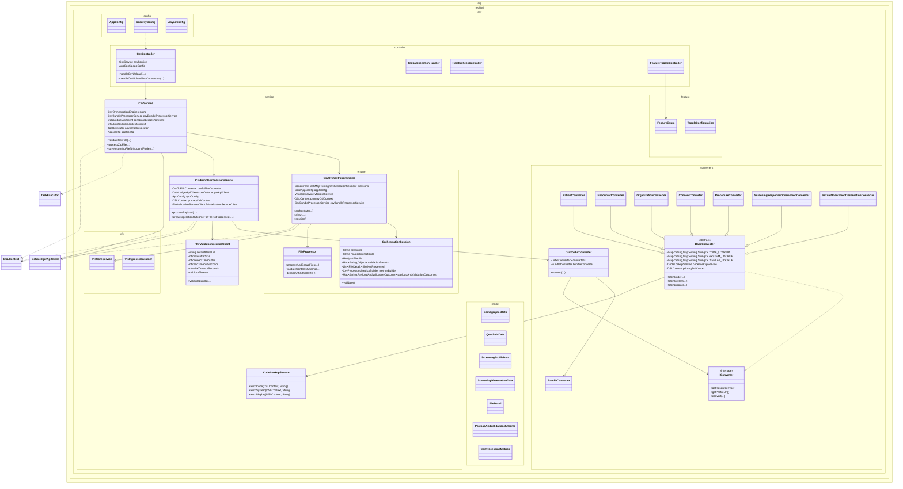

# csv-service Module Deep Analysis

Document version: 1.0  
Date: 2026-03-16  
Scope: Full source and test analysis of the csv-service Maven module

## 1. Executive Summary

`csv-service` is a Spring Boot module responsible for ingesting ZIP-packaged CSV files, validating file and content quality, converting CSV records into FHIR R4 bundles, and optionally invoking downstream FHIR validation and data-ledger diagnostics.

At runtime, this module acts as a high-throughput ingestion and transformation service with:

- Public CSV endpoints in `CsvController`
- Orchestration lifecycle in `CsvService` and `CsvOrchestrationEngine`
- File-level UTF-8 and Unicode quality screening in `FileProcessor`
- Domain conversion pipeline in `CsvBundleProcessorService` and `CsvToFhirConverter`
- FHIR validation handoff via `FhirValidationServiceClient`
- Data-ledger and DB persistence via JOOQ routines and `DataLedgerApiClient`

This module has broad coupling with `core-lib` and database routines from `udi-jooq-ingress`.

## 2. Module Inventory and Size

### 2.1 Source footprint

- Main Java files: 45
- Test Java files: 12

### 2.2 Package composition

- `org.techbd.csv`: 1
- `org.techbd.csv.config`: 7
- `org.techbd.csv.controller`: 4
- `org.techbd.csv.converters`: 11
- `org.techbd.csv.feature`: 2
- `org.techbd.csv.model`: 9
- `org.techbd.csv.service`: 5
- `org.techbd.csv.service.engine`: 2
- `org.techbd.csv.service.vfs`: 2
- `org.techbd.csv.util`: 2

### 2.3 Build metadata

- Packaging: `jar`
- Parent: `polyglot-prime`
- Java target inherited from parent: 21
- Runtime stack: Spring Boot Web + Security + WebFlux + JOOQ + HAPI FHIR

## 3. Dependency and Build Analysis

## 3.1 Key direct dependencies in `csv-service/pom.xml`

- Spring Boot starters: `web`, `security`, `webflux`, `validation`, `jooq`, `test`
- `core-lib` module dependency
- HAPI FHIR R4 structures
- OpenCSV
- Togglz feature toggles
- PostgreSQL + HikariCP
- JOOQ jackson extensions
- Apache Commons VFS starter
- Local system-scoped JAR for generated routines: `udi-jooq-ingress`

## 3.2 Notable dependency/build characteristics

1. Uses a system-scoped local JAR (`lib/techbd-udi-jooq-ingress.auto.jar`).
   - Portability and CI reproducibility concern.

2. Includes both Spring MVC (`spring-boot-starter-web`) and WebFlux (`spring-boot-starter-webflux`).
   - Acceptable for selective WebClient usage, but increases surface area and dependency complexity.

3. Spring Boot plugin uses `includeSystemScope=true`.
   - This is required by current local-JAR strategy but reinforces artifact coupling.

## 4. Public Architecture and Responsibilities

## 4.1 Entry and API layer

### `CsvApplication`

- Spring Boot entry point with `scanBasePackages = { "org.techbd" }`.

### `CsvController`

- Exposes:
  - `POST /flatfile/csv/Bundle/$validate`
  - `POST /flatfile/csv/Bundle`
- Validates upload constraints (`.zip`, non-empty, tenant header presence).
- Builds request detail maps via `CoreFHIRUtil`.
- Delegates to:
  - `CsvService.validateCsvFile(...)`
  - `CsvService.processZipFile(...)`

### `HealthCheckController`

- GET/HEAD `/` health endpoint.

### `FeatureToggleController`

- Runtime feature enable/disable/status APIs for Togglz features.

### `GlobalExceptionHandler`

- Maps common request and multipart failures to JSON response bodies.
- Logs request context and emits system diagnostics on severe paths.

## 4.2 Service and orchestration layer

### `CsvService`

Core coordinator for request lifecycle:

- Performs initial guard checks and metadata logging.
- Creates and tracks interaction IDs.
- Saves archive-level interaction status and outcomes via JOOQ routines.
- Supports sync and async execution modes (`immediate` request parameter).
- Invokes:
  - `CsvOrchestrationEngine` for structural validation + grouped payloads
  - `CsvBundleProcessorService` for conversion and downstream validation
- Emits data-ledger events through `DataLedgerApiClient` (feature-gated).

### `CsvOrchestrationEngine`

- Maintains in-flight sessions in `ConcurrentHashMap<String, OrchestrationSession>`.
- Constructs `OrchestrationSession` with builder pattern.
- Session `validate()` triggers grouped processing and validation state persistence.
- Stores outcome maps, files-not-processed, and metrics builders.

### `FileProcessor`

- Reads ZIP-extracted CSV files and enforces strict UTF-8 decoding.
- Detects problematic Unicode categories (control chars, surrogate/non-character, BOM-in-middle, etc.).
- Groups files by inferred group key and blocks entire groups when one file fails validation.

### `CsvBundleProcessorService`

- Converts validated grouped payloads into FHIR bundle results.
- Parses CSV text into model maps using `CsvConversionUtil`.
- Validates required map presence before conversion.
- Converts group encounters into bundle payloads via `CsvToFhirConverter`.
- Invokes `FhirValidationServiceClient` and persists conversion status/errors.
- Emits DataLedger diagnostic events for failures and invalid groups.

### `FhirValidationServiceClient`

- WebClient-based HTTP client for downstream FHIR validation endpoint.
- Supports request-header propagation and custom base URL override (`X-TechBD-BL-BaseURL`).
- Configurable timeout/buffer behavior using env-based properties.
- Throws custom `FhirValidationException` on remote or processing failures.

### `CodeLookupService`

- Loads code/system/display lookup maps from DB view `REF_CODE_LOOKUP_CODE_VIEW`.
- Used by converter base for coding normalization.

## 4.3 Conversion layer (`converters`)

### Pipeline structure

- `CsvToFhirConverter` creates base bundle via `BundleConverter` then applies all injected `IConverter` beans.
- Converter ordering controlled via `@Order` annotations.

Observed converter ordering:

1. `OrganizationConverter` (`@Order(1)`)
2. `PatientConverter` (`@Order(2)`)
3. `SexualOrientationObservationConverter` (`@Order(3)`)
4. `ConsentConverter` (`@Order(4)`)
5. `EncounterConverter` (`@Order(5)`)
6. `ScreeningResponseObservationConverter` (`@Order(6)`)
7. `ProcedureConverter` (`@Order(7)`)

### Key classes

- `IConverter`: conversion contract + common profile/meta helpers.
- `BaseConverter`: shared code lookup methods and helper builders.
- `BundleConverter`: bundle shell generation and meta/security initialization.
- Resource-specific converters: `Patient`, `Encounter`, `Organization`, `Consent`, `Procedure`, screening observation converters.

## 4.4 VFS integration

### `VfsCoreService`

- Directory setup, file existence checks, and VFS consumer orchestration.

### `VfsIngressConsumer`

- Ingress file draining workflow:
  - snapshotting
  - optional unzip transform
  - grouping
  - complete/incomplete group partitioning
- Includes audit event records and extensible `QuadFunction` hooks.

## 4.5 Configuration and toggles

### `AppConfig`

- Binds `org.techbd.*` properties (versioning, FHIR URLs, IG package map, CSV validation script paths, data ledger and auth settings).

### `SecurityConfig`

- Permits CSV and feature endpoints; denies everything else.
- Maps denied/unmatched requests to 404-like behavior.

### `AsyncConfig`

- Configures thread-pool task executor via environment variables.

### Togglz

- `FeatureEnum`:
  - `FEATURE_DATA_LEDGER_TRACKING`
  - `FEATURE_DATA_LEDGER_DIAGNOSTICS`
- `TogglzConfiguration` uses a permissive feature admin user provider.

## 4.6 Data models

Primary model role is CSV mapping and orchestration state transport:

- CSV domain rows: `DemographicData`, `QeAdminData`, `ScreeningProfileData`, `ScreeningObservationData`
- Processing contracts: `FileDetail`, `PayloadAndValidationOutcome`, `CsvProcessingMetrics`, `CsvDataValidationStatus`, `FileType`

## 4.7 Detailed Class Diagram

The diagram below emphasizes structural dependencies and major behavioral classes used in production flow.

Diagram interpretation notes:

- Solid arrows represent explicit class dependencies/composition.
- Inheritance arrows (`--|>`) represent converter hierarchy.
- Dashed arrows indicate infrastructure or framework dependency.

## 5. Runtime Flow (End-to-End)

1. Client uploads ZIP to `CsvController` endpoint.
2. Controller validates basic request constraints and builds request/header maps.
3. `CsvService` persists initial interaction and optional data-ledger receipt.
4. `CsvOrchestrationEngine` session validates and groups extracted files.
5. `FileProcessor` enforces UTF-8 and Unicode content checks.
6. `CsvBundleProcessorService` parses CSVs to typed models.
7. `CsvToFhirConverter` applies ordered converters into a FHIR bundle.
8. `FhirValidationServiceClient` calls downstream validator endpoint.
9. `CsvService` persists final operation outcomes and processing status.
10. Response returns sync result payload or async accepted marker.

## 6. Configuration Contract Summary

### 6.1 Critical properties

- `org.techbd.version`
- `org.techbd.csv.validation.*` (script path, package path, inbound/outbound paths)
- `org.techbd.baseFHIRURL`
- `org.techbd.structureDefinitionsUrls.*`
- `org.techbd.validation-severity-level`
- `org.techbd.dataLedgerApiUrl`
- `org.techbd.dataLedgerApiKeySecretName`
- `org.techbd.udi.prime.jdbc.*`
- `TECHBD_BL_BASEURL`

### 6.2 Async and client tuning env vars

- `TECHBD_CSV_ASYNC_EXECUTOR_CORE_POOL_SIZE`
- `TECHBD_CSV_ASYNC_EXECUTOR_MAX_POOL_SIZE`
- `TECHBD_CSV_ASYNC_EXECUTOR_QUEUE_CAPACITY`
- `TECHBD_CSV_ASYNC_EXECUTOR_AWAIT_TERMINATION_SECONDS`
- `FHIR_CLIENT_MAX_BUFFER_SIZE`
- `FHIR_CLIENT_CONNECT_TIMEOUT_MS`
- `FHIR_CLIENT_READ_TIMEOUT_SECONDS`
- `FHIR_CLIENT_WRITE_TIMEOUT_SECONDS`
- `FHIR_CLIENT_BLOCK_TIMEOUT_SECONDS`

### 6.3 Feature toggles

- `FEATURE_DATA_LEDGER_TRACKING`
- `FEATURE_DATA_LEDGER_DIAGNOSTICS`

## 7. Test Coverage and Quality Signals

## 7.1 Existing test surface

- Converter-focused tests exist (patient, encounter, organization, procedure, consent, screening observation).
- Engine test exists (`FileProcessorTest`).
- Service tests for `CsvService` and `CsvBundleProcessorService` exist as files.

## 7.2 Coverage gaps and reliability concerns

1. `CsvServiceTest` is effectively disabled/commented-out code.
2. `CsvBundleProcessorServiceTest` appears legacy/commented and not active.
3. No robust integration test for end-to-end flow (`upload -> orchestrate -> convert -> validate -> persist`).
4. Limited tests around async execution and concurrent orchestration sessions.
5. Security behavior (`permitAll`/deny-all responses) is not explicitly tested.
6. VFS failure/edge behavior has limited direct test evidence.

## 8. Findings: Risks and Code Smells

Severity scale: High, Medium, Low.

1. High: Static mutable caches in `BaseConverter` for code/system/display lookups.
   - Shared mutable static state may create race conditions under concurrent startup/traffic.

2. High: Incomplete critical service tests (`CsvServiceTest`, `CsvBundleProcessorServiceTest`).
   - Operational confidence is lower for main orchestration paths.

3. Medium: `VfsIngressConsumer` catches broad exceptions and calls `printStackTrace()`.
   - Inconsistent production logging and reduced observability discipline.

4. Medium: Security configuration exposes ingestion and feature-toggle endpoints as `permitAll`.
   - Potentially acceptable by design, but high-risk unless controlled by network perimeter/auth upstream.

5. Medium: Hardcoded coding values and TODO markers in several converters.
   - Terminology/profile drift risk and maintainability burden.

6. Medium: Sync/async outcome persistence has duplicate patterns and overloaded methods in `CsvService`.
   - Increases defect probability and maintenance cost.

7. Medium: Error handling mixes custom outcomes with broad catches in conversion/orchestration layers.
   - Can hide root causes and blur failed-vs-partial-success distinctions.

8. Low: Typo-level and quality artifacts (`resonseParameters`, repeated map key assignment in async response).
   - Signals cleanup opportunities and potential accidental regressions.

9. Low: System-scoped local JAR dependency.
   - Packaging/deployment hygiene concern.

## 9. Recommended Refactoring Roadmap

## Phase 1: Reliability and safety

1. Replace static mutable caches in `BaseConverter` with immutable, thread-safe cache strategy.
2. Reactivate and modernize `CsvServiceTest` and `CsvBundleProcessorServiceTest`.
3. Remove `printStackTrace()` and standardize structured logging in VFS paths.
4. Fix small correctness issues (duplicate map puts, typos, null handling hotspots).

## Phase 2: Security and governance

1. Reassess endpoint exposure strategy in `SecurityConfig` (authn/authz or trusted edge-only access).
2. Lock down feature toggle administration pathways.
3. Validate and sanitize externally supplied override headers more strictly.

## Phase 3: Maintainability and architecture

1. Externalize remaining hardcoded coding/URI values to configuration or lookup tables.
2. Consolidate persistence update methods in `CsvService` to reduce duplication.
3. Move away from system-scoped local JAR to repository-managed artifact strategy.

## 10. Practical Guidance for Consumers and Maintainers

- Prefer touching converter behavior through `IConverter` contract and converter ordering awareness.
- Treat `CsvService` and `CsvOrchestrationEngine` as the core transaction boundary.
- Validate compatibility whenever changing:
  - `AppConfig` property names
  - converter ordering
  - `CoreFHIRUtil` profile-map usage
  - DataLedger feature toggle behavior

## 11. Final Assessment

`csv-service` is a substantial and critical ingestion/conversion module with strong functional breadth and clear layering. It already provides robust content validation and FHIR transformation capabilities, but production confidence would improve significantly with stronger active test coverage, reduced static mutable state, and tighter security posture around public endpoints.

Overall maturity: Moderate to High  
Operational importance: High  
Risk profile: Moderate (higher in testability and concurrency-sensitive paths)
