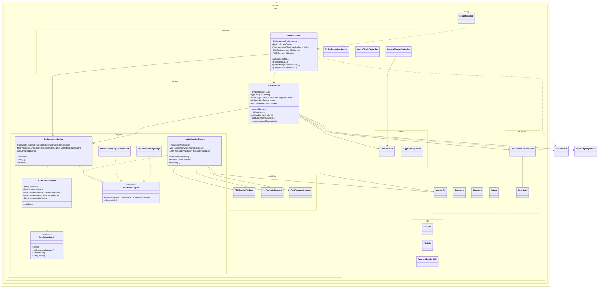

# fhir-validation-service Module Deep Analysis

Document version: 1.0  
Date: 2026-03-16  
Scope: Full source and test analysis of the fhir-validation-service Maven module

## 1. Executive Summary

`fhir-validation-service` is the FHIR validation gateway for the platform. It accepts FHIR bundles, validates profile conformity against SHIN-NY IG packages, persists interaction states via JOOQ routines, and conditionally emits Data Ledger tracking/diagnostics.

At runtime, this module combines:

- Public validation and status endpoints (`FhirController`)
- Validation orchestration with pluggable validation engines (`OrchestrationEngine`)
- HAPI FHIR package-based IG validation (primary engine)
- Optional/placeholder HL7 validation paths (embedded/API classes)
- DB state transitions (`RegisterInteractionFhirRequest` routines)
- Feature-gated Data Ledger integration

It is a high-impact core service for correctness and interoperability.

## 2. Module Inventory and Size

### 2.1 Source footprint

- Main Java files: 22
- Test Java files: 3

### 2.2 Package composition

- `org.techbd.fhir`: 1
- `org.techbd.fhir.config`: 5
- `org.techbd.fhir.controller`: 4
- `org.techbd.fhir.exceptions`: 2
- `org.techbd.fhir.feature`: 2
- `org.techbd.fhir.service`: 1
- `org.techbd.fhir.service.engine`: 1
- `org.techbd.fhir.service.validation`: 3
- `org.techbd.fhir.util`: 3

### 2.3 Build metadata

- Packaging: `jar`
- Parent: `polyglot-prime`
- Java target inherited from parent: 21
- Runtime stack: Spring Boot Web + Security + WebFlux + JOOQ + HAPI FHIR + Togglz

## 3. Dependency and Build Analysis

## 3.1 Key direct dependencies in `fhir-validation-service/pom.xml`

- HAPI FHIR: client, base, structures-r4, validation, validation resources
- Spring Boot starters: web, security, webflux, thymeleaf, jooq, test
- `core-lib` module dependency
- PostgreSQL + HikariCP
- JOOQ jackson extensions
- Togglz feature toggles
- AWS Secrets Manager SDK
- Commons VFS starter
- system-scoped local JAR: `udi-jooq-ingress`

## 3.2 Notable dependency/build characteristics

1. Uses local system-scoped generated JOOQ artifact (`lib/techbd-udi-jooq-ingress.auto.jar`).
   - Portability and reproducibility concern.

2. Maven Surefire is configured with `testFailureIgnore=true`.
   - Risk that CI might pass despite failing tests.

3. Includes both MVC and WebFlux stacks.
   - Adds flexibility for HTTP client patterns but increases framework surface.

## 4. Public Architecture and Responsibilities

## 4.1 API and controller layer

### `FhirValidationApplication`

- Spring Boot entry point (`scanBasePackages = { "org.techbd" }`).

### `FhirController`

- Endpoints include:
  - `POST /Bundle/$validate`
  - `GET /Bundle/$status/{bundleSessionId}`
  - `GET /metadata`
  - `GET /Bundles/status/nyec-submission-failed`
  - `GET /Bundles/status/operation-outcome`
- Builds request maps from headers/query params using `CoreFHIRUtil`.
- Delegates bundle validation to `FHIRService.processBundle(...)`.
- Retrieves status and reporting data from service/db pathways.

### `GlobalExceptionHandler`

- Handles request parsing, media type, timeout, multipart and generic failures.
- Produces API-friendly error responses and logs diagnostics.

### `HealthCheckController` and `FeatureToggleController`

- Health endpoint and runtime feature state operations.

## 4.2 Service layer

### `FHIRService`

Core workflow service:

- Validates payload JSON integrity and Bundle profile URL policy.
- Orchestrates validation through `OrchestrationEngine`.
- Registers initial payload, validation result, forward/final/failure states in DB.
- Applies severity filtering of validation issues.
- Handles operational paths for health-check and disposition behavior.
- Integrates with `DataLedgerApiClient` based on feature toggles.

Important methods:

- `processBundle(...)`
- `validateJson(...)`
- `validateBundleProfileUrl(...)`
- `validate(...)`
- `registerOriginalPayload(...)`
- `registerValidationResults(...)`

## 4.3 Engine and validation layer

### `OrchestrationEngine`

- Manages validation sessions (`ConcurrentHashMap<String, OrchestrationSession>`).
- Provides builder-style session setup.
- Caches engine instances keyed by engine identifier.
- Initializes three engine types:
  - `HapiValidationEngine`
  - `Hl7ValidationEngineEmbedded`
  - `Hl7ValidationEngineApi`

### `HapiValidationEngine`

- Primary production validator.
- Loads IG packages and base packages into `NpmPackageValidationSupport`.
- Builds HAPI support chain with pre/post population supports.
- Supports dynamic IG selection using header-provided version.
- Returns operation outcome through `ValidationResult` contract.

### `Hl7ValidationEngineEmbedded` and `Hl7ValidationEngineApi`

- Embedded path is placeholder/stub behavior.
- API path submits payload to HL7 external validator endpoint (`validator.fhir.org`).

### `FhirBundleValidator`

- Encapsulates context, validator, IG version and package metadata.

### Validation support helpers

- `PrePopulateSupport`: loads code systems/terminology support assets.
- `PostPopulateSupport`: post-load terminology/profile enrichment.

## 4.4 Configuration and utilities

### `AppConfig`

- Binds `org.techbd.*` property tree including IG packages, profile maps, severity, data ledger settings.

### `SecurityConfig`

- Permits validation/status/metadata and feature endpoints; denies others.
- Converts denied routes to 404 responses.

### `FHIRUtil`

- Shared static utilities for profile URLs, allowed URL list, bundle ID extraction, and request/response header shaping.

### Feature toggles

- `FeatureEnum` and `TogglzConfiguration`:
  - `FEATURE_DATA_LEDGER_TRACKING`
  - `FEATURE_DATA_LEDGER_DIAGNOSTICS`

## 4.5 Detailed Class Diagram

Diagram notes:

- Solid arrows represent direct composition/dependency.
- Inheritance arrows (`..|>`) represent engine-interface implementations.
- Utility and infra dependencies (JOOQ, security integration) are intentionally simplified.

## 5. Runtime Flow (End-to-End)

1. `FhirController.validateBundle(...)` receives payload and request metadata.
2. `FHIRService.processBundle(...)` validates JSON and profile policy.
3. Initial payload and metadata are persisted using JOOQ routine registration.
4. `FHIRService.validate(...)` builds `OrchestrationSession` and attaches HAPI engine.
5. `OrchestrationEngine.orchestrate(...)` executes engine validation across payload(s).
6. Validation results are transformed into `OperationOutcome` map.
7. Disposition/state records are persisted in DB.
8. Optional Data Ledger calls execute if feature toggles are enabled.
9. Controller returns final validation result/disposition response.

## 6. Configuration Contract Summary

### 6.1 Core property families

- `org.techbd.version`
- `org.techbd.baseFHIRURL`
- `org.techbd.ig-packages.fhir-v4.shinny-packages.*`
- `org.techbd.ig-packages.fhir-v4.base-packages.*`
- `org.techbd.structureDefinitionsUrls.*`
- `org.techbd.validation-severity-level`
- `org.techbd.operationOutcomeHelpUrl`
- `org.techbd.dataLedgerApiUrl`
- `org.techbd.dataLedgerApiKeySecretName`
- `org.techbd.udi.prime.jdbc.*`

### 6.2 Feature toggles

- `FEATURE_DATA_LEDGER_TRACKING` (default false)
- `FEATURE_DATA_LEDGER_DIAGNOSTICS` (default true)

### 6.3 Key request headers used in flow

- `X-TechBD-Tenant-ID` (required)
- `X-SHIN-NY-IG-Version` (optional)
- `X-TechBD-Validation-Severity-Level` (optional)
- `X-TechBD-Group-Interaction-ID` / `X-TechBD-Master-Interaction-ID` (optional)
- `X-TechBD-Interaction-ID` (optional)

## 7. Test Coverage and Quality Signals

## 7.1 Existing tests

- `OrchestrationEngineTest`: session orchestration behavior, caching and representative validation checks.
- `IgPublicationIssuesTest`: broad IG example validation matrix against many SHIN-NY example bundles.
- `BaseIgValidationTest`: shared test setup and mocks.

## 7.2 Coverage gaps

1. Limited direct unit coverage for `FHIRService` core orchestration/persistence pathways.
2. Minimal controller-level tests (`FhirController`, exception handler, security routes).
3. No dedicated tests for HL7 API engine behavior and timeout/error handling.
4. No explicit stress/concurrency tests on engine/session cache behavior.
5. No tests that assert feature-toggle effects on Data Ledger behavior.

## 8. Findings: Risks and Code Smells

Severity scale: High, Medium, Low.

1. High: Mutable fields inside cached singleton `HapiValidationEngine`.
   - `fhirProfileUrl` and `igVersion` are mutated per request, increasing cross-request contamination risk.

2. High: Session map in `OrchestrationEngine` is manually cleared and unbounded.
   - Potential memory growth if sessions are not consistently cleared.

3. Medium: `HapiValidationEngine.findFhirBundleValidator(...)` uses `System.out.println` in production path.
   - Logging inconsistency and noise.

4. Medium: Dynamic IG loading from request-provided version strings.
   - Requires stricter allow-listing and guardrails to avoid unsupported path usage.

5. Medium: Broad exception catches in validation path can hide root causes.
   - Risk of coarse `OperationOutcome` diagnostics and debugging difficulty.

6. Medium: `Hl7ValidationEngineApi` blocks on `CompletableFuture.join()` for remote call.
   - Can increase latency and failure coupling to external service availability.

7. Medium: Security config is broad permit-all for core endpoints.
   - May be intentional, but requires compensating controls at edge/network layer.

8. Low: Multiple TODOs indicate unfinished behavior (sync forwarding, severity/disposition path hardening).

9. Low: `testFailureIgnore=true` in surefire may hide regressions in CI pipelines.

## 9. Recommended Refactoring Roadmap

## Phase 1: Correctness and safety

1. Remove mutable request-specific state from cached validation engines.
2. Introduce bounded session lifecycle/expiry in `OrchestrationEngine`.
3. Replace `System.out.println` with structured logger usage.
4. Add strict request-level IG version allow-list validation.

## Phase 2: Reliability and observability

1. Strengthen exception taxonomy and error propagation in validation engines.
2. Add resilience policies for external HL7 API validation path.
3. Improve diagnostics around Data Ledger feature-gated decision points.

## Phase 3: Testing and maintainability

1. Add `FHIRService` unit tests for process paths and negative cases.
2. Add `FhirController` + `SecurityConfig` contract tests.
3. Add concurrency/stress tests for orchestration session lifecycle.
4. Revisit `testFailureIgnore=true` policy for stricter CI quality gates.

## 10. Practical Guidance for Maintainers

- Treat `FHIRService.processBundle(...)` and `OrchestrationEngine` as core stability boundaries.
- Any changes to IG package loading should be validated against both `shinny` and `test-shinny` suites.
- Preserve compatibility of request header contract and `OperationOutcome` shape to avoid downstream consumer breakage.

## 11. Final Assessment

`fhir-validation-service` is architecturally strong in modular validation orchestration and real IG-backed test data usage. The biggest engineering risks are around mutable shared engine state, cache/session lifecycle hardening, and incomplete test depth for service/controller/security concerns.

Overall maturity: High for validation capabilities, Moderate for concurrency hardening  
Operational importance: Very High  
Risk profile: Moderate (with High hotspots around shared mutable state and session lifecycle)
