# hub-prime Module Deep Analysis

Document version: 1.0  
Date: 2026-03-16  
Scope: Full source and test analysis of the hub-prime Maven module

## 1. Executive Summary

`hub-prime` is the platform gateway module combining public API endpoints, UI/UX pages, interaction capture/audit, and orchestration handoff for FHIR and CSV workflows.

At runtime this module acts as the central ingress layer with:

- Public API endpoints for FHIR, CSV, and expectation workflows
- Request/response capture and persistence in `InteractionsFilter` + `InteractionService`
- UI/operational dashboards under `/needs-attention`, `/interactions`, `/data-quality`, `/docs`, and tabular APIs
- Security modes for authenticated GitHub OAuth (`SecurityConfig`) and local open profile (`NoAuthSecurityConfig`)
- Deep dependency on `nexus-core-lib` for FHIR/CSV processing engines and service logic
- Data access via generated JOOQ routines from system-scoped `udi-jooq-ingress.auto.jar`

This module has the broadest web surface in the repository and is a high-impact integration boundary.

## 2. Module Inventory and Size

### 2.1 Source footprint

- Main Java files: 98
- Test Java files: 19
- Resource config files (`application*.yml`): 6

### 2.2 Package composition (major)

- `org.techbd.service.http.hub.prime.ux`: 12
- `org.techbd.service.http`: 12
- `org.techbd.util`: 10
- `lib.aide.resource.content`: 9
- `lib.aide.resource`: 9
- `lib.aide.tabular`: 6
- `lib.aide.paths`: 5
- `lib.aide.resource.collection`: 4
- `org.techbd.service.http.hub.prime.route`: 3
- `org.techbd.service.http.hub.prime.api`: 3
- `org.techbd.service.http.hub.prime`: 3
- `org.techbd.service.constants`: 3
- `org.techbd.orchestrate.sftp`: 2
- `org.techbd.orchestrate.fhir.util`: 2
- `org.techbd.conf`: 2
- `org.techbd.service`: 2

### 2.3 Build metadata

- Packaging: `jar`
- Parent: `polyglot-prime`
- Java target: 21
- Runtime style: Spring MVC + Thymeleaf UI + WebFlux client + JOOQ + JPA + OAuth2

## 3. Dependency and Build Analysis

### 3.1 Key direct dependencies in `hub-prime/pom.xml`

- Spring Boot starters: `web`, `webflux`, `security`, `thymeleaf`, `actuator`, `jpa`, `jooq`, `validation`, `mail`, `oauth2-client`, `cache`, `test`
- HAPI stack: `hapi-fhir-base`, `hapi-fhir-structures-r4`, `hapi-fhir-validation`, `hapi-fhir-validation-resources-r4`, `hapi-fhir-client`, plus HL7 v2 structures (`hapi-structures-v27`, `hapi-structures-v28`)
- `org.techbd:nexus-core-lib` (core orchestration/service dependency)
- system-scoped `org.techbd.udi.auto:udi-jooq-ingress` from `hub-prime/lib/techbd-udi-jooq-ingress.auto.jar`
- JOOQ + jooq-jackson-extensions
- Observability stack: Micrometer + OpenTelemetry OTLP exporters
- UI/API support: springdoc OpenAPI, HTMX, flexmark, GitHub API

### 3.2 Notable dependency/build characteristics

1. System-scoped generated JOOQ jar is required for DB routines.
   - Portability and reproducibility risk across CI/dev machines.

2. Module mixes MVC UI, REST APIs, and reactive client stack.
   - Flexible, but broad dependency and runtime surface.

3. Spring Boot plugin includes `includeSystemScope=true`.
   - Necessary for current jar strategy, but increases packaging coupling.

4. Static analysis plugins are present (PMD, Checkstyle, SpotBugs, ArchUnit tests).
   - Good governance, but several tests still carry TODO notes.

## 4. Public Architecture and Responsibilities

### 4.1 Entry point

#### `Application`

- Spring Boot app with `scanBasePackages = { "org.techbd" }`
- Enables JPA repositories, caching, scheduling, and configuration properties

### 4.2 API controllers (ingress endpoints)

#### `FhirController` (`org.techbd.service.http.hub.prime.api`)

Primary FHIR endpoints:

- `GET /metadata`
- `POST /Bundle`, `/Bundle/`
- `POST /Bundle/$validate`, `/Bundle/$validate/`
- `GET /Bundle/$status/{bundleSessionId}`
- `POST /Bundle/replay`, `/Bundle/replay/`
- `GET /Bundles/status/nyec-submission-failed`
- `GET /Bundles/status/operation-outcome`

Behavior:

- Validates key headers (tenant and optional correlation ID)
- Builds header/request context maps via `CoreFHIRUtil` + `FHIRUtil`
- Delegates processing to `FHIRService`
- Applies response headers/cookies with interaction metadata

#### `CsvController` (`org.techbd.controller.http.hub.prime.api`)

CSV endpoints:

- `POST /flatfile/csv/Bundle/$validate`
- `POST /flatfile/csv/Bundle`, `/flatfile/csv/Bundle/`

Behavior:

- Validates zip file requirements and tenant header
- Builds request context and correlation metadata
- Delegates to `CsvService.validateCsvFile(...)` or `CsvService.processZipFile(...)`

#### `ExpectController`

- Provides expectation/test utility endpoint at `/api/expect/fhir/bundle`

### 4.3 UX and console controllers

Major UI controllers in `org.techbd.service.http.hub.prime.ux`:

- `NeedAttentionController`
- `InteractionsController`
- `DataQualityController`
- `ContentController`
- `DocsController`
- `PrimeController`
- `ShellController`
- `TabularRowsController`
- `MavenController`
- `ConsoleController`
- `ExperimentsController`

These controllers serve diagnostics pages, tabular APIs, docs surfaces, and navigation endpoints.

### 4.4 Interaction capture and persistence

#### `InteractionsFilter`

- Ordered early (`@Order(-999)`) and wraps request/response bodies
- Enforces host allow-list (`TECHBD_ALLOWED_HOSTS`) for most endpoints
- Special-cases `/metadata` path for bypass
- Builds `Interactions.RequestEncountered` / `RequestResponseEncountered`
- Applies persistence matching rules using URI + method matchers
- Delegates persistence to `InteractionService` for selected request classes

#### `InteractionService`

- Persists interactions via JOOQ routine `RegisterUserInteraction`
- Stores payload, tenant, provenance, version, and optionally user metadata
- Uses authenticated GitHub user context when available

### 4.5 Security and profile behavior

#### `SecurityConfig` (non-`localopen` profile)

- Two chains:
  - Stateless API chain for configured API URL set (`permitAll`, CSRF disabled)
  - Authenticated chain for broader UI/private routes with OAuth2 login
- Adds GitHub authz filter (`GitHubUserAuthorizationFilter`)
- Configures headers, CORS, and forwarded-header support

#### `NoAuthSecurityConfig` (`localopen` profile)

- Permits all requests for local development
- Disables CSRF and keeps CORS/forwarded-header setup

### 4.6 Data access and tabular query endpoints

#### `TabularRowsController`

- Exposes JOOQ-backed table/view query API endpoints
- Supports dynamic schema/table paths and stored procedure execution
- Uses `primaryDslContext` and optional `secondaryDslContext` read replica
- Provides AG-grid style paging/filtering integration via `lib.aide.tabular`

### 4.7 Shared library surface inside module (`lib.aide.*`)

`hub-prime` includes an embedded utility/library layer:

- `lib.aide.resource*` for markdown/json/yaml/mdx content abstractions
- `lib.aide.resource.collection` for VFS/GitHub resource loading
- `lib.aide.tabular` for generic tabular response wiring
- `lib.aide.paths` for JSON/path transformations
- `lib.aide.vfs` for VFS ingress helpers

### 4.8 Detailed Class Diagram

```mermaid
classDiagram
direction TB

namespace org.techbd.service.http.hub.prime {
  class Application
}

namespace org.techbd.service.http.hub.prime.api {
  class FhirController {
    -OrchestrationEngine engine
    -CoreAppConfig appConfig
    -CoreDataLedgerApiClient dataLedgerApiClient
    -FHIRService fhirService
    -FhirReplayService fhirReplayService
    -DSLContext primaryDslContext
    +metadata(...)
    +validateBundleAndForward(...)
    +validateBundle(...)
    +bundleStatus(...)
  }
  class ExpectController
}

namespace org.techbd.controller.http.hub.prime.api {
  class CsvController {
    -CsvService csvService
    -CoreAppConfig coreAppConfig
    +handleCsvUpload(...)
    +handleCsvUploadAndConversion(...)
  }
}

namespace org.techbd.service.http {
  class InteractionsFilter {
    -InteractionService interactionService
    -InteractionPersistRules iprDB
    -List~String~ allowedHosts
    +doFilterInternal(...)
  }
  class InteractionPersistRules
  class SecurityConfig {
    -GitHubUserAuthorizationFilter authzFilter
    +statelessSecurityFilterChain(...)
    +securityFilterChain(...)
  }
  class NoAuthSecurityConfig
  class GitHubUserAuthorizationFilter
  class Interactions {
    +RequestEncountered
    +RequestResponseEncountered
    +Tenant
  }
}

namespace org.techbd.service {
  class InteractionService {
    -DSLContext primaryDslContext
    -CoreAppConfig coreAppConfig
    +saveInteractionToDatabase(...)
  }
}

namespace org.techbd.service.http.hub.prime.ux {
  class NeedAttentionController
  class InteractionsController
  class DocsController
  class TabularRowsController {
    -DSLContext primaryDslContext
    -DSLContext readerDSlContext
    +tabularRows(...)
    +fetchDataFromStoredProc(...)
  }
}

namespace lib.aide.tabular {
  class JooqRowsSupplier
  class JooqRowsSupplierForSP
  class TabularRowsRequest
  class TabularRowsRequestForSP
  class TabularRowsResponse
}

namespace lib.aide.resource.collection {
  class Resources
  class VfsResources
  class GitHubRepoResources
}

namespace nexus.core.lib {
  class OrchestrationEngine
  class FHIRService
  class CsvService
  class CoreDataLedgerApiClient
}

namespace db.routines {
  class RegisterUserInteraction {
    <<routine>>
    +execute(...)
  }
}

Application --> FhirController
Application --> CsvController
Application --> NeedAttentionController
Application --> TabularRowsController

FhirController --> FHIRService
FhirController --> OrchestrationEngine
FhirController --> CoreDataLedgerApiClient
FhirController ..> DSLContext

CsvController --> CsvService

InteractionsFilter --> InteractionService
InteractionsFilter --> Interactions
InteractionsFilter --> InteractionPersistRules

SecurityConfig --> GitHubUserAuthorizationFilter

InteractionService --> RegisterUserInteraction
InteractionService ..> DSLContext

TabularRowsController --> JooqRowsSupplier
TabularRowsController --> JooqRowsSupplierForSP
TabularRowsController --> TabularRowsRequest
TabularRowsController --> TabularRowsRequestForSP
TabularRowsController --> TabularRowsResponse

DocsController --> Resources
Resources --> VfsResources
Resources --> GitHubRepoResources
```

Diagram interpretation notes:

- Solid arrows show direct dependencies/composition.
- Dashed arrows indicate framework/context usage.
- `nexus.core.lib` classes are consumed cross-module services, not locally implemented in `hub-prime`.

## 5. Runtime Flow (End-to-End)

### 5.1 FHIR bundle flow

1. Client submits payload to `POST /Bundle` or `POST /Bundle/$validate`.
2. `InteractionsFilter` wraps and captures request context.
3. Host validation is enforced (except explicit metadata bypass path).
4. Security chain applies OAuth/no-auth profile behavior.
5. `FhirController` validates required input and builds request parameter maps.
6. `FHIRService` (from `nexus-core-lib`) processes/validates payload via orchestration engine.
7. Validation outcomes/disposition are built and returned.
8. Interaction persistence is applied through JOOQ routine paths.
9. Response headers/cookies include interaction metadata.

### 5.2 CSV ingestion flow

1. Client submits zip to `/flatfile/csv/Bundle` or `/flatfile/csv/Bundle/$validate`.
2. `CsvController` validates file extension/non-empty and tenant requirements.
3. Request/header context maps are populated.
4. `CsvService` (from `nexus-core-lib`) performs CSV parsing/conversion/validation flow.
5. Aggregated results are returned (sync or async mode depending on `immediate` flag).

### 5.3 UX diagnostics flow

1. Browser requests diagnostics pages and tabular endpoints.
2. `TabularRowsController` resolves table/proc requests and uses JOOQ suppliers.
3. Data is shaped into tabular response contracts and rendered by frontend pages.

## 6. Configuration Contract Summary

### 6.1 Key properties in `application.yml`

- `spring.profiles.active`
- `org.techbd.service.http.hub.prime.version`
- `org.techbd.service.http.hub.prime.fhirVersion`
- `org.techbd.service.http.interactions.defaultPersistStrategy`
- `org.techbd.service.http.interactions.persist.db.uri-matcher.regex`
- `org.techbd.service.http.interactions.saveUserDataToInteractions`
- `org.techbd.udi.uiReadsFromReaderEnabled`
- `org.techbd.udi.prime.jdbc.*`
- `org.techbd.udi.secondary.jdbc.*`
- `spring.servlet.multipart.*`
- `springdoc.*`
- `management.tracing.*` and `management.otlp.*`

### 6.2 Environment and operational controls

- `TECHBD_ALLOWED_HOSTS`
- `SPRING_PROFILES_ACTIVE`
- `ORG_TECHBD_DB_READ_WRITE_SPLIT_ENABLED`
- Profile-specific DB credentials (`<profile>_TECHBD_UDI_DS_*`)
- OpenObserve OTLP credentials and stream settings

### 6.3 Profile variants

- `application-devl.yml`
- `application-stage.yml`
- `application-phiqa.yml`
- `application-phiprod.yml`
- `application-sandbox.yml`

## 7. Test Coverage and Quality Signals

### 7.1 Existing test surface

- ArchUnit rules: naming, cyclic dependency, interfaces, general architecture
- Utility tests (`JsonTextTest`, `InterpolateEngineTest`, `ArtifactStoreTest`)
- Resource/tabular/VFS tests under `lib.aide.*`
- Basic application context test (`ApplicationTests`)
- Controller-level test (`TabularRowsControllerTest`)

### 7.2 Coverage gaps and concerns

1. No robust endpoint tests for `FhirController` major bundle paths.
2. No dedicated tests for `CsvController` upload/validation pathways.
3. Minimal direct tests for `InteractionsFilter` behavior and host header logic.
4. No focused tests for `InteractionService` DB persistence contract.
5. Security behavior across profiles (`localopen` vs OAuth2) is not strongly test-verified.
6. Multiple ArchUnit tests contain TODO notes indicating unstable/disabled expectations.

## 8. Findings: Risks and Code Smells

Severity scale: High, Medium, Low.

1. High: Hardcoded SMTP credentials in `application.yml`.
   - Secret-management and leakage risk unless always overridden at runtime.

2. High: System-scoped generated JOOQ jar dependency.
   - Build reproducibility and dependency drift risk.

3. High: Missing endpoint-level tests for FHIR and CSV ingress paths.
   - Low confidence on highest-impact request paths.

4. Medium: TODO in `InteractionsFilter` indicates config binding fallback for URI matcher rules.
   - Runtime behavior may diverge from expected property-driven rules.

5. Medium: `InteractionsFilter` metadata bypass and host filtering logic can become policy-sensitive.
   - Should be tightly documented and perimeter-controlled.

6. Medium: `InteractionService` currently sets `DEFAULT_ROLE` placeholder despite auth context.
   - Incomplete role-based audit fidelity.

7. Medium: Read/write split support needs explicit consistency strategy and test coverage.

8. Low: Broad TODO/FIXME markers (17 occurrences across main and test) indicate known but unresolved debt.

## 9. Recommended Refactoring Roadmap

### Phase 1: Reliability and test hardening

1. Add integration tests for key FHIR/CSV ingress endpoints.
2. Add filter tests for host validation, payload capture, and health-check skip logic.
3. Add service tests around `InteractionService` JOOQ routine field mapping.
4. Stabilize ArchUnit test TODOs to enforce architecture rules consistently.

### Phase 2: Security and governance

1. Remove hardcoded mail credentials and enforce env/secret manager only.
2. Finalize role mapping in interactions persistence (`DEFAULT_ROLE` removal).
3. Reconcile host-header bypass policy for `/metadata` and document trusted-source assumptions.

### Phase 3: Build and architecture hygiene

1. Reduce system-scoped jar risk by publishing generated artifacts to an internal artifact repository.
2. Clarify module ownership split between `hub-prime` and `nexus-core-lib` services.
3. Consolidate config behavior for interaction persist rules to avoid code-level fallback lists.

## 10. Cross-Module Coupling Snapshot

`hub-prime` is coupled to the following major shared/runtime components:

- `nexus-core-lib`:
  - `org.techbd.service.fhir.FHIRService`
  - `org.techbd.service.fhir.engine.OrchestrationEngine`
  - `org.techbd.service.csv.CsvService`
  - `org.techbd.service.dataledger.CoreDataLedgerApiClient`

- Generated JOOQ routines from `udi-jooq-ingress.auto.jar`:
  - `RegisterUserInteraction`
  - table metadata classes used by tabular routes and status/reporting paths

This coupling pattern positions `hub-prime` as the web/API edge, with domain orchestration delegated to shared core modules.
