# nexus-ingestion-api Module Deep Analysis

Document version: 1.0  
Date: 2026-03-17  
Scope: Full source and test analysis of the nexus-ingestion-api Maven module

## 1. Executive Summary

`nexus-ingestion-api` is the multi-protocol data ingestion gateway for healthcare payloads. It accepts messages over **HTTPS (REST)**, **MLLP/TCP** (for HL7v2), and **SOAP** (for IHE ITI PIX/PnR), and reliably persists them to AWS S3 with structured metadata before publishing routing messages to AWS SQS FIFO queues.

At runtime this module acts as the ingress relay layer with:

- REST endpoints for file/body ingestion (`/ingest`, `/hold`) and XDS.b repository forwarding (`/xds/XDSbRepositoryWS`)
- SOAP/WS endpoints for IHE ITI PIX (Patient Identity Feed) and PnR (Provide and Register Document Set-b) transactions at `/ws`
- Netty-based TCP server with HAProxy Proxy Protocol support for MLLP/HL7v2 message reception
- A configurable two-step processing pipeline: **S3 upload → SQS publish**
- mTLS client certificate validation via S3-hosted CA bundles
- Port-based routing configuration loaded from S3 (or local JSON in sandbox mode)
- Feature toggles via Togglz for runtime behavior control
- Custom SOAP message factory supporting SOAP 1.1, 1.2, and MTOM/XOP multipart
- Structured error handling with error trace IDs and SOAP fault generation

This module has **no database dependencies** — it is a stateless relay that stores payloads in S3 and publishes routing metadata to SQS for downstream consumers.

## 2. Module Inventory and Size

### 2.1 Source footprint

- Main Java files: 65
- Test Java files: 19
- Resource config files (`application*.yml`): 2

### 2.2 Package composition (major)

- `org.techbd.ingest.controller`: 6 (DataIngestionController, DataHoldController, XdsRepositoryController, InteractionsFilter, SoapFaultEnhancementFilter, FeatureToggleController, CachedBodyHttpServletRequest)
- `org.techbd.ingest.config`: 7 (AppConfig, AwsConfig, SecurityConfig, WebServiceConfig, PortConfig, NettyProxyConfig, NettyProxyDecoderConfig, MllpHealthIndicator)
- `org.techbd.ingest.service`: 3 (MessageProcessorService, MetadataBuilderService, SoapForwarderService)
- `org.techbd.ingest.service.portconfig`: 9 (PortResolverService, PortConfigApplierService, PortConfigResolver, PortConfigAttributeResolver, PortResolver, BucketResolverImpl, DataDirResolverImpl, QueueResolverImpl, RouteParamResolver)
- `org.techbd.ingest.service.messagegroup`: 7 (MessageGroupService, MessageGroupStrategy, IpPortMessageGroupStrategy, MllpMessageGroupStrategy, SourceMsgTypeGroupStrategy, TcpMessageGroupStrategy, TenantMessageGroupStrategy)
- `org.techbd.ingest.service.iti`: 1 (AcknowledgementService)
- `org.techbd.ingest.endpoint`: 2 (PixEndpoint, PnrEndpoint)
- `org.techbd.ingest.interceptors`: 1 (WsaHeaderInterceptor)
- `org.techbd.ingest.processor`: 3 (MessageProcessingStep, S3UploadStep, SqsPublishStep)
- `org.techbd.ingest.listener`: 1 (NettyTcpServer)
- `org.techbd.ingest.model`: 1 (RequestContext)
- `org.techbd.ingest.commons`: 3 (Constants, MessageSourceType, PortBasedPaths)
- `org.techbd.ingest.exceptions`: 4 (GlobalExceptionHandler, ErrorResponse, DetailedErrorLog, ErrorTraceIdGenerator, CustomSoapFaultResolver)
- `org.techbd.ingest.feature`: 3 (FeatureEnum, CheckFeature, TogglzConfiguration)
- `org.techbd.ingest.util`: 7 (AppLogger, TemplateLogger, Hl7Util, HttpUtil, LogUtil, ProxyProtocolParserUtil, SoapFaultUtil, SoapResponseUtil)
- `org.techbd.ingest`: 3 (NexusIngestionApiApplication, AbstractMessageSourceProvider, MessageSourceProvider)

### 2.3 Build metadata

- Packaging: `jar`
- Parent: `polyglot-prime`
- Java target: 21
- Runtime style: Spring MVC + Spring WS (SOAP) + Netty TCP + AWS SDK v2 + Apache Camel + Togglz

## 3. Dependency and Build Analysis

### 3.1 Key direct dependencies in `nexus-ingestion-api/pom.xml`

- Spring Boot starters: `web`, `actuator`, `security`, `web-services`, `test`
- Spring WS Core 4.1.1 (explicit version, excluded from starter and re-added)
- AWS SDK v2: `s3`, `sqs`, `aws-core` (v2.28.0)
- Spring Cloud AWS: `spring-cloud-starter-aws` (v2.4.4)
- Netty: `netty-all` (v4.1.108.Final), `netty-codec-haproxy`
- Apache Camel: `camel-core` (4.16.0), `camel-spring-boot-starter` (4.10.0), `camel-mllp-starter` (4.10.0), `camel-netty` (4.10.0)
- HAPI HL7 v2: `hapi-base`, `hapi-structures-v23` through `v28` (v2.6.0)
- IHE/XDS: `ipf-commons-ihe-xds` (v4.1.0)
- JAXB: `jakarta.xml.bind-api` (4.0.0), `jaxb-runtime` (4.0.3)
- WSDL4J
- Togglz: `togglz-console-spring-boot-starter`, `togglz-spring-web` (v4.4.0)
- Bouncy Castle: `bcprov-jdk18on`, `bcpkix-jdk18on` (v1.78.1) for mTLS certificate handling
- Jackson, Gson, Lombok
- JAXB2 Maven Plugin for XSD-to-Java generation

### 3.2 Notable dependency/build characteristics

1. **No database dependency.** Unlike `hub-prime`, this module is stateless — it only uses S3 and SQS for persistence and messaging.

2. **Version conflicts in Camel.** `camel-core` is declared at 4.16.0 while `camel-spring-boot-starter` and `camel-mllp-starter` are at 4.10.0. This version mismatch may cause subtle runtime issues.

3. **JAXB2 code generation** from IHE/HL7 XSD schemas produces generated types under `org.techbd.iti.schema`.

4. **Mixed JSON libraries.** Both Jackson (`jackson-databind` 2.15.0) and Gson (2.10.1) are present. Jackson is the primary serializer; Gson appears unused or redundant.

5. **Spring WS module exclusion/re-add.** `spring-ws-core` is excluded from the `web-services` starter and added back at a specific version (4.1.1).

6. **Spring Boot plugin includes `includeSystemScope=true`** although no system-scoped dependencies exist in this module — likely inherited boilerplate.

## 4. Public Architecture and Responsibilities

### 4.1 Entry point

#### `NexusIngestionApiApplication`

- Spring Boot app with `scanBasePackages = { "org.techbd" }`
- Implements `CommandLineRunner` (logs startup message)

### 4.2 API controllers (ingress endpoints)

#### `DataIngestionController` (`/ingest`)

Primary data ingestion endpoints:

- `GET /ingest/` — Health check
- `POST /ingest`, `/ingest/`, `/ingest/{sourceId}/{msgType}` — Universal ingestion

Behavior:

- Accepts multipart file uploads, raw body (text/xml, application/xml, JSON), and `multipart/related` (MTOM/XOP)
- Detects SOAP requests by `msgType` or allowed routes configuration and forwards them to `/ws` via `SoapForwarderService`
- For non-SOAP requests, delegates to `MessageProcessorService` pipeline (S3 → SQS)
- Generates interaction IDs and builds `RequestContext` with full metadata

#### `DataHoldController` (`/hold`)

Hold/staging ingestion endpoint:

- `POST /hold` — Accepts files or raw body, stores to a separate "hold" S3 bucket

Behavior:

- Same multipart/raw body handling as `DataIngestionController`
- Uses `MessageSourceType.HTTP_HOLD` for hold-specific S3 bucket routing
- On processing failure, attempts to store the original payload as a best-effort fallback

#### `XdsRepositoryController` (`/xds/XDSbRepositoryWS`)

XDS.b Repository facade:

- `POST /xds/XDSbRepositoryWS` — Accepts SOAP/MTOM requests and forwards them to `/ws`

Behavior:

- Reads raw request bytes directly from the input stream
- Delegates to `SoapForwarderService` for Content-Type reconstruction and forwarding

#### `FeatureToggleController` (`/api/features`)

Runtime feature flag management:

- `POST /api/features/{featureName}/enable`
- `POST /api/features/{featureName}/disable`
- `GET /api/features/{featureName}`
- `GET /api/features` — Lists all features and their states

### 4.3 SOAP/WS endpoints

#### `PixEndpoint` (IHE ITI PIX)

SOAP endpoint for Patient Identity Feed:

- `PRPA_IN201301UV02` — Patient Add
- `PRPA_IN201302UV02` — Patient Update
- `PRPA_IN201304UV02` — Patient Merge/Duplicate Resolved

Behavior:

- Receives JAXB-unmarshalled HL7v3 XML payloads
- Extracts `sourceId`, `msgType`, and `interactionId` from HTTP headers
- Creates `RequestContext` and generates `MCCIIN000002UV01` acknowledgement
- Delegates processing to `WsaHeaderInterceptor` which calls `MessageProcessorService` in `handleResponse`

#### `PnrEndpoint` (IHE ITI-41 XDS.b PnR)

SOAP endpoint for Provide and Register Document Set-b:

- `ProvideAndRegisterDocumentSetRequest` — Document submission

Behavior:

- Receives IHE ITI-41 documents with MTOM/XOP attachments
- Generates `RegistryResponseType` acknowledgement
- Processing delegated through interceptor → `MessageProcessorService`

### 4.4 TCP/MLLP listener

#### `NettyTcpServer`

Netty-based TCP server for MLLP (HL7v2) and generic TCP message reception:

- Listens on configurable `TCP_DISPATCHER_PORT` (default: 7980)
- Supports HAProxy Proxy Protocol v1/v2 for preserving original client IPs behind load balancers
- Implements MLLP framing (VT/FS/CR delimiters) and configurable TCP delimiters
- Generates HL7 ACK/NACK responses for MLLP messages
- Supports keep-alive/persistent connections with session tracking
- Implements idle timeout handling and message size limits
- Per-message interaction IDs with per-session session IDs for log correlation

### 4.5 Interaction capture and request filtering

#### `InteractionsFilter`

- Runs as `OncePerRequestFilter` on all inbound HTTP requests
- Assigns `interactionId` (from header or generated UUID)
- Caches `multipart/related` request bodies via `CachedBodyHttpServletRequest`
- Resolves the request port and extracts `sourceId`/`msgType` from URI path
- Uses `PortResolverService` to find matching `PortConfig.PortEntry` and rejects requests with no matching config
- Implements mTLS client certificate validation:
  - Downloads CA bundles from S3 (with 60-minute cache)
  - Parses PEM certificate chains via Bouncy Castle
  - Validates client certificates against CA trust anchors using PKIX
- Wraps response with Content-Type override when `ackContentType` is configured

#### `SoapFaultEnhancementFilter`

- Runs at `LOWEST_PRECEDENCE` (last in chain) on `/ws` endpoints
- Captures SOAP fault responses and injects `errorTraceId` for traceability
- Ensures fault payloads are processed through `MessageProcessorService` for S3 storage

### 4.6 Processing pipeline

#### `MessageProcessorService`

Orchestrates the message processing pipeline:

- Iterates through ordered `List<MessageProcessingStep>` implementations
- Each step has an `isEnabledFor(context)` guard based on `MessageSourceType` flags
- Applies `PortConfigApplierService` overrides before processing
- Returns structured success response with `messageId`, `interactionId`, S3 paths, and `timestamp`

#### `S3UploadStep` (Order 1)

- Uploads the data payload to S3 (`data/YYYY/MM/DD/timestamp-interactionId-filename`)
- Uploads a JSON metadata file to the metadata bucket
- Optionally uploads an ACK message to S3
- Uses `MetadataBuilderService` for structured metadata construction

#### `SqsPublishStep` (Order 2)

- Publishes a routing message to SQS FIFO queue
- Uses `MessageGroupService` to compute `messageGroupId` for FIFO ordering
- Skips publishing when `ingestionFailed` is true or when message source type disables SQS

### 4.7 SOAP forwarding

#### `SoapForwarderService`

- Forwards SOAP requests from `/ingest` and `/xds` to the internal `/ws` endpoint
- Uses `java.net.http.HttpClient` with connection pooling (HTTP/1.1)
- Reconstructs `multipart/related` Content-Type from raw bytes when missing (XDS.b MTOM scenario)
- Forwards all original request headers (excluding restricted ones like `host`, `connection`, `content-length`)
- Generates structured SOAP faults (1.1 and 1.2) on errors with XML-escaped error messages

### 4.8 Port configuration system

#### `PortConfig`

- Loads port routing configuration from S3 (prod) or local `list.json` (sandbox)
- Each `PortEntry` defines: port, protocol, responseType, sourceId, msgType, route, queue, dataDir, metadataDir, mtls settings, ackContentType, keepAliveTimeout
- Identifies MLLP ports (TCP protocol with MLLP response type) for `NettyTcpServer`

#### `PortResolverService` / `PortConfigApplierService`

- Resolves matching `PortEntry` for a request based on port, sourceId, and msgType
- Applies override attributes (S3 bucket, queue URL, data directory, metadata directory) to `RequestContext`
- Strategy-based resolution via `PortConfigResolver` implementations

### 4.9 Message group service

#### `MessageGroupService`

- Generates deterministic `messageGroupId` for SQS FIFO ordering
- Delegates to strategy chain: `SourceMsgTypeGroupStrategy`, `MllpMessageGroupStrategy`, `TcpMessageGroupStrategy`, `TenantMessageGroupStrategy`, `IpPortMessageGroupStrategy`
- Falls back to `DEFAULT_MESSAGE_GROUP` when no strategy matches

### 4.10 WS-Addressing interceptor

#### `WsaHeaderInterceptor`

- Captures raw SOAP messages on `/ws` requests
- In `handleResponse`, builds SOAP response with WS-Addressing headers and delegates to `MessageProcessorService` for S3/SQS processing
- Handles SOAP faults with `errorTraceId` injection and structured error logging

### 4.11 Detailed Class Diagram

```mermaid
classDiagram
direction TB

namespace org.techbd.ingest {
  class NexusIngestionApiApplication
  class AbstractMessageSourceProvider
  class MessageSourceProvider {
    <<interface>>
    +getMessageSource()
    +getDataBucketName()
    +getMetadataBucketName()
  }
}

namespace org.techbd.ingest.controller {
  class DataIngestionController {
    -SoapForwarderService forwarder
    -MessageProcessorService messageProcessorService
    -SoapFaultUtil soapFaultUtil
    +healthCheck()
    +ingest(...)
  }
  class DataHoldController {
    -MessageProcessorService messageProcessorService
    -PortConfig portConfig
    +hold(...)
  }
  class XdsRepositoryController {
    -SoapForwarderService forwarder
    +handleXdsRequest(...)
  }
  class InteractionsFilter {
    -PortConfig portConfig
    -PortResolverService portResolverService
    -S3Client s3Client
    -SoapFaultUtil soapFaultUtil
    +doFilterInternal(...)
  }
  class SoapFaultEnhancementFilter {
    -MessageProcessorService messageProcessorService
    +doFilterInternal(...)
  }
  class FeatureToggleController {
    -FeatureManager featureManager
    +enableFeature(...)
    +disableFeature(...)
    +isFeatureActive(...)
  }
  class CachedBodyHttpServletRequest
}

namespace org.techbd.ingest.config {
  class AppConfig {
    -Aws aws
    -Soap soap
    -String version
  }
  class AwsConfig {
    +s3Client()
    +sqsClient()
  }
  class SecurityConfig {
    +securityFilterChain(...)
  }
  class WebServiceConfig {
    +webServiceTemplate()
    +messageDispatcherServlet(...)
    +pixWsdl(...)
    +pnrWsdl(...)
  }
  class PortConfig {
    -List~PortEntry~ portConfigurationList
    +loadConfig()
    +findEntryForPort(...)
  }
  class NettyProxyConfig
  class NettyProxyDecoderConfig
  class MllpHealthIndicator
}

namespace org.techbd.ingest.endpoint {
  class PixEndpoint {
    -AcknowledgementService ackService
    +handlePixAdd(...)
    +handlePixUpdate(...)
    +handlePixDuplicateResolved(...)
  }
  class PnrEndpoint {
    -AcknowledgementService ackService
    +handleProvideAndRegister(...)
  }
}

namespace org.techbd.ingest.service {
  class MessageProcessorService {
    -List~MessageProcessingStep~ processingSteps
    -PortConfigApplierService portConfigApplierService
    +processMessage(context, file)
    +processMessage(context, content, ackMessage)
  }
  class MetadataBuilderService {
    +buildS3Metadata(...)
    +buildMetadataJson(...)
    +buildSqsMessage(...)
  }
  class SoapForwarderService {
    -HttpClient httpClient
    +forward(request, rawBytes, sourceId, msgType, interactionId)
  }
}

namespace org.techbd.ingest.service.iti {
  class AcknowledgementService {
    +createPixAcknowledgement(...)
    +createPnrAcknowledgement(...)
  }
}

namespace org.techbd.ingest.processor {
  class MessageProcessingStep {
    <<interface>>
    +process(context, file)
    +process(context, content, ackMessage)
    +isEnabledFor(context)
  }
  class S3UploadStep {
    -S3Client s3Client
    -MetadataBuilderService metadataBuilderService
  }
  class SqsPublishStep {
    -SqsClient sqsClient
    -MessageGroupService messageGroupService
  }
}

namespace org.techbd.ingest.listener {
  class NettyTcpServer {
    -MessageProcessorService messageProcessorService
    -PortResolverService portResolverService
    +start()
  }
}

namespace org.techbd.ingest.service.messagegroup {
  class MessageGroupService {
    -List~MessageGroupStrategy~ strategies
    +createMessageGroupId(...)
  }
  class MessageGroupStrategy {
    <<interface>>
    +supports(context)
    +createGroupId(context, interactionId)
  }
}

namespace org.techbd.ingest.service.portconfig {
  class PortResolverService {
    -List~PortConfigResolver~ resolvers
    +resolve(context, protocol)
  }
  class PortConfigApplierService {
    -List~PortConfigAttributeResolver~ attributeResolvers
    +applyPortConfigOverrides(context)
  }
}

namespace org.techbd.ingest.interceptors {
  class WsaHeaderInterceptor {
    -SoapResponseUtil soapResponseUtil
    -MessageProcessorService messageProcessorService
    +handleRequest(...)
    +handleResponse(...)
    +handleFault(...)
  }
}

namespace org.techbd.ingest.model {
  class RequestContext {
    -String interactionId
    -String tenantId
    -MessageSourceType messageSourceType
    -String objectKey
    -String queueUrl
    -String dataBucketName
    -boolean ingestionFailed
  }
}

namespace org.techbd.ingest.commons {
  class MessageSourceType {
    <<enum>>
    HTTP_INGEST
    HTTP_HOLD
    MLLP
    TCP
    SOAP_PIX
    SOAP_PNR
  }
}

NexusIngestionApiApplication --> DataIngestionController
NexusIngestionApiApplication --> DataHoldController
NexusIngestionApiApplication --> XdsRepositoryController
NexusIngestionApiApplication --> PixEndpoint
NexusIngestionApiApplication --> PnrEndpoint
NexusIngestionApiApplication --> NettyTcpServer

DataIngestionController --> MessageProcessorService
DataIngestionController --> SoapForwarderService
DataIngestionController --|> AbstractMessageSourceProvider

DataHoldController --> MessageProcessorService
DataHoldController --|> AbstractMessageSourceProvider

XdsRepositoryController --> SoapForwarderService
XdsRepositoryController --|> AbstractMessageSourceProvider

PixEndpoint --> AcknowledgementService
PixEndpoint --|> AbstractMessageSourceProvider

PnrEndpoint --> AcknowledgementService
PnrEndpoint --|> AbstractMessageSourceProvider

AbstractMessageSourceProvider ..|> MessageSourceProvider

InteractionsFilter --> PortResolverService
InteractionsFilter --> PortConfig
InteractionsFilter ..> S3Client

SoapFaultEnhancementFilter --> MessageProcessorService

WsaHeaderInterceptor --> MessageProcessorService
WsaHeaderInterceptor --> SoapResponseUtil

MessageProcessorService --> S3UploadStep
MessageProcessorService --> SqsPublishStep
MessageProcessorService --> PortConfigApplierService

S3UploadStep ..|> MessageProcessingStep
S3UploadStep --> MetadataBuilderService
S3UploadStep ..> S3Client

SqsPublishStep ..|> MessageProcessingStep
SqsPublishStep --> MessageGroupService
SqsPublishStep ..> SqsClient

PortConfigApplierService --> PortResolverService

NettyTcpServer --> MessageProcessorService
NettyTcpServer --> PortResolverService

AwsConfig --> AppConfig
AwsConfig ..> S3Client
AwsConfig ..> SqsClient

PortConfig ..> S3Client

MllpHealthIndicator --> PortConfig

WebServiceConfig --> WsaHeaderInterceptor
```

Diagram interpretation notes:

- Solid arrows show direct dependencies/composition.
- Dashed arrows indicate framework/context or client usage.
- `--|>` shows inheritance; `..|>` shows interface implementation.
- `AbstractMessageSourceProvider` provides the template for building `RequestContext` with S3 paths, metadata keys, and tenant resolution.

## 5. Runtime Flow (End-to-End)

### 5.1 HTTP ingestion flow (REST)

1. Client submits payload to `POST /ingest/{sourceId}/{msgType}` or `POST /hold`.
2. `InteractionsFilter` assigns `interactionId`, caches multipart body, resolves port config, and validates mTLS if configured.
3. `SecurityConfig` permits the request (CSRF disabled, specific paths allowed).
4. Controller validates input, detects SOAP vs. non-SOAP content.
5. For SOAP content: `SoapForwarderService` forwards raw bytes to `/ws` for Spring-WS processing.
6. For non-SOAP content: `MessageProcessorService` executes pipeline:
   - `S3UploadStep`: Uploads payload + metadata JSON to S3.
   - `SqsPublishStep`: Publishes routing message to SQS FIFO with computed `messageGroupId`.
7. Controller returns JSON response with `interactionId`, `messageId`, S3 paths, and timestamp.

### 5.2 SOAP/WS ingestion flow (PIX/PnR)

1. SOAP request arrives at `/ingest/{sourceId}/{msgType}` (forwarded to `/ws`) or directly at `/ws`.
2. `WebServiceConfig.SmartSoapMessageFactory` auto-detects SOAP version (1.1/1.2) and handles MTOM multipart.
3. `WsaHeaderInterceptor.handleRequest()` captures raw SOAP XML.
4. Spring-WS dispatches to `PixEndpoint` or `PnrEndpoint` based on XML namespace/local part.
5. Endpoint creates `RequestContext` and generates acknowledgement (HL7v3 MCCI or RegistryResponse).
6. `WsaHeaderInterceptor.handleResponse()` builds WS-Addressing response headers and calls `MessageProcessorService` (S3 + SQS).
7. SOAP acknowledgement is returned to the client.

### 5.3 TCP/MLLP ingestion flow

1. External system connects to `NettyTcpServer` on configured TCP port.
2. HAProxy Proxy Protocol header (if present) is decoded to extract original client IP/port.
3. MLLP-framed HL7v2 message is parsed (VT start, FS/CR end delimiters).
4. HL7v2 message is parsed via HAPI to generate ACK/NACK response.
5. `PortResolverService` resolves the matching port config entry.
6. `MessageProcessorService` pipeline executes (S3 → SQS).
7. ACK/NACK is sent back on the TCP connection.
8. Keep-alive connections support multiple messages per session.

### 5.4 XDS.b repository flow

1. Client submits MTOM/SOAP request to `POST /xds/XDSbRepositoryWS`.
2. `XdsRepositoryController` reads raw request bytes.
3. `SoapForwarderService` reconstructs `multipart/related` Content-Type boundary from raw bytes if missing.
4. Request is forwarded internally to `/ws` where `PnrEndpoint` handles it.
5. Response is relayed back to the client.

## 6. Configuration Contract Summary

### 6.1 Key properties in `application.yml`

- `server.port` (default: 8080 via `${SERVER_PORT}`)
- `org.techbd.version`
- `org.techbd.aws.region`
- `org.techbd.aws.s3.default-config.bucket` / `metadata-bucket`
- `org.techbd.aws.s3.hold-config.bucket` / `metadata-bucket`
- `org.techbd.aws.sqs.fifo-queue-url`
- `org.techbd.soap.wsa.*` (WS-Addressing namespace, action, prefix)
- `spring.profiles.active` (default: `sandbox`)
- `spring.servlet.multipart.*`
- `management.endpoints.web.exposure.include` (health, info)
- `togglz.enabled`
- Logging levels for Camel MLLP components

### 6.2 Environment and operational controls

- `SERVER_PORT`
- `SPRING_PROFILES_ACTIVE`
- `AWS_S3_BUCKET_NAME`, `AWS_S3_METADATA_BUCKET_NAME`, `HOLD_S3_BUCKET_NAME`
- `AWS_SQS_QUEUE_NAME`
- `AWS_REGION`, `AWS_ACCESS_KEY_ID`, `AWS_SECRET_ACCESS_KEY`
- `TCP_DISPATCHER_PORT` (default: 7980)
- `TCP_READ_TIMEOUT_SECONDS` (default: 180)
- `TCP_MAX_MESSAGE_SIZE_BYTES` (default: 50MB)
- `TCP_MESSAGE_START_DELIMITER`, `TCP_MESSAGE_END_DELIMITER_1`, `TCP_MESSAGE_END_DELIMITER_2`
- `TCP_SESSION_LOG_INTERVAL_SECONDS` (default: 60)
- `PORT_CONFIG_S3_BUCKET`, `PORT_CONFIG_S3_KEY`
- `MTLS_BUCKET`
- `ALLOWED_WS_ROUTES`
- `USE_EXTERNAL_URL`
- `UNDERSTOOD_NAMESPACES`
- `MULTIPART_FILE_SIZE`, `MULTIPART_REQUEST_SIZE`
- `MAX_SWALLOW_SIZE`, `MAX_HTTP_FORM_POST_SIZE`

### 6.3 Profile variants

- `application.yml` (default, references `sandbox` profile)
- `application-sandbox.yml` (LocalStack endpoints for S3/SQS)

### 6.4 Feature toggles (Togglz)

- `DEBUG_LOG_REQUEST_HEADERS` (enabled by default)
- `IGNORE_MUST_UNDERSTAND_HEADERS` (enabled by default)
- `LOG_INCOMING_MESSAGE`
- `ADD_NTE_SEGMENT_TO_HL7_ACK` (enabled by default)
- `SEND_HL7_ACK_ON_IDLE_TIMEOUT`
- `INCLUDE_TECHBD_INTERACTION_ID_IN_SOAP_RESPONSE`

## 7. Test Coverage and Quality Signals

### 7.1 Existing test surface

- `InteractionsFilterTest`: Tests for the HTTP request filter (port resolution, mTLS, multipart caching)
- `DataIngestionControllerTest`: Controller-level tests for `/ingest` endpoints
- `DataHoldControllerTest`: Controller-level tests for `/hold` endpoint
- `S3UploadStepTest`: Tests for S3 upload processor step
- `SqsPublishStepTest`: Tests for SQS publishing processor step
- `MessageProcessorServiceTest`: Tests for pipeline orchestration
- `MessageGroupServiceTest`: Tests for message group ID generation strategies
- `MetadataBuilderServiceTest`: Tests for metadata construction
- `PortResolverServiceTest` / `PortResolverTest`: Port configuration resolution tests
- `PortConfigApplierServiceTest`: Port config override application tests
- `BucketResolverImplTest`, `DataDirResolverImplTest`, `QueueResolverImplTest`, `RouteParamResolverTest`: Individual attribute resolver tests
- `NettyProxyDecoderConfigTest`: Netty decoder configuration tests
- `ProxyProtocolParserUtilTest`: Proxy Protocol parsing utility tests
- `SoapMessageValidationTest`: SOAP message validation tests
- `ZNTParserTest`: HL7 segment parsing tests

### 7.2 Coverage gaps and concerns

1. No end-to-end integration tests with actual S3/SQS (even via LocalStack).
2. No tests for `SoapForwarderService` multipart Content-Type reconstruction logic.
3. No tests for `WebServiceConfig.SmartSoapMessageFactory` SOAP version detection.
4. No tests for `PixEndpoint` / `PnrEndpoint` SOAP processing paths.
5. No tests for `NettyTcpServer` TCP/MLLP message framing, keep-alive, and ACK generation.
6. No security-focused tests for mTLS certificate validation flow.
7. No tests for `GlobalExceptionHandler` structured error responses.

## 8. Findings: Risks and Code Smells

Severity scale: High, Medium, Low.

1. **High: Camel version mismatch.** `camel-core` at 4.16.0 vs. `camel-spring-boot-starter`/`camel-mllp-starter` at 4.10.0.
   - Risk of binary incompatibility and subtle runtime failures.

2. **High: Missing endpoint-level tests for SOAP PIX/PnR and TCP/MLLP paths.**
   - Highest-traffic ingestion paths have no automated validation.

3. **High: mTLS CA bundle downloaded from S3 with only a 60-minute cache.**
   - If S3 is unavailable, mTLS validation will fail. No fallback mechanism or graceful degradation documented.

4. **Medium: Port configuration loaded once at startup with no reload mechanism (non-sandbox).**
   - Configuration changes require application restart.

5. **Medium: Duplicate JSON library usage (Jackson + Gson).**
   - Gson dependency appears unused; increases dependency footprint.

6. **Medium: `SoapForwarderService` uses environment variable `USE_EXTERNAL_URL` for URL construction.**
   - Mix of Spring properties and raw `System.getenv()` accesses across the codebase.

7. **Medium: `InteractionsFilter` writes JSON error responses manually via string formatting.**
   - Risk of JSON injection if error messages contain special characters (partially mitigated by escaping).

8. **Medium: `NettyTcpServer` handles all TCP protocols in one class.**
   - At ~800+ lines, this class mixes Netty bootstrap, MLLP/TCP framing, HL7 parsing, HAProxy decoding, and message processing — candidate for decomposition.

9. **Low: Single TODO marker** in `AcknowledgementService` for error trace ID inclusion in PnR responses.

10. **Low: `spring-cloud-starter-aws` (v2.4.4) is a legacy dependency.**
	- The Spring Cloud AWS project has been restructured; this older artifact may conflict with the direct AWS SDK v2 usage.

## 9. Recommended Refactoring Roadmap

### Phase 1: Reliability and test hardening

1. Add integration tests for S3/SQS pipeline using LocalStack (testcontainers).
2. Add endpoint tests for `PixEndpoint` and `PnrEndpoint` SOAP processing.
3. Add `SoapForwarderService` tests covering multipart Content-Type reconstruction and header forwarding.
4. Add `NettyTcpServer` tests for MLLP framing, keep-alive, and error scenarios.
5. Add mTLS certificate chain validation tests with mock S3 CA bundles.

### Phase 2: Build and dependency hygiene

1. Align Camel versions — use a single BOM-managed version across `camel-core`, `camel-mllp-starter`, and `camel-netty`.
2. Remove `gson` dependency if Jackson is the sole serializer.
3. Evaluate replacement of `spring-cloud-starter-aws` with direct AWS SDK v2 usage (already present).
4. Remove `includeSystemScope=true` from Spring Boot Maven plugin if no system-scoped deps exist.

### Phase 3: Architecture hygiene

1. Decompose `NettyTcpServer` into separate Netty bootstrap, protocol handler, and message processor classes.
2. Consolidate environment variable access — prefer Spring `@Value` / `@ConfigurationProperties` over raw `System.getenv()`.
3. Add a port configuration reload mechanism (scheduled or event-driven) to avoid restart requirement.
4. Replace manual JSON error response construction in `InteractionsFilter` with `GlobalExceptionHandler` patterns.

### Phase 4: Security hardening

1. Add graceful degradation for mTLS when S3 CA bundle is unavailable.
2. Document the mTLS trust chain verification flow and CA bundle rotation process.
3. Add rate limiting or request throttling at the ingestion layer.

## 10. Cross-Module Coupling Snapshot

`nexus-ingestion-api` is **self-contained** with no cross-module Java dependencies within the polyglot-prime repository. It does not depend on:

- `nexus-core-lib`
- `hub-prime`
- `core-lib`
- `csv-service`
- `fhir-validation-service`

External runtime couplings:

- **AWS S3**: Payload and metadata storage, CA bundle storage for mTLS, port configuration storage
- **AWS SQS FIFO**: Downstream message routing/notification
- **IHE/HL7 Standards**: HL7v3 (PIX), HL7v2 (MLLP), XDS.b (PnR), WS-Addressing
- **Generated JAXB types**: From IHE/HL7 XSD schemas under `src/main/resources/ITI/schema/`

This isolation positions `nexus-ingestion-api` as an independent, deployable ingestion relay with no shared-module dependencies.
