# udi-prime Module Deep Analysis

Document version: 1.0  
Date: 2026-03-17  
Scope: Full source and test analysis of the udi-prime Deno/TypeScript + PostgreSQL module

## 1. Executive Summary

`udi-prime` is the **database schema management, migration, and code generation** module for the polyglot-prime platform. Unlike the other Java/Maven modules, it runs on the **Deno runtime with TypeScript** and targets a **PostgreSQL** database. Its responsibilities span:

- **Schema definition** — Data Vault 2.0 schema modeling (Hubs, Satellites, Links) using the `sql-aide` type-safe SQL generation library for the `techbd_udi_ingress`, `techbd_udi_assurance`, and `techbd_udi_diagnostics` PostgreSQL schemas.
- **Migration execution** — ISLM (Information Schema Lifecycle Management) framework wrapping SQL into versioned stored procedures with idempotent apply/rollback semantics.
- **Idempotent SQL infrastructure** — ~14,350 lines of PostgreSQL `psql` scripts defining 94+ SQL objects (views, functions, procedures) for interaction registration, FHIR screening/assessment analytics, dashboard queries, user management, HL7/CCDA/CSV replay, and scheduled monitoring.
- **JOOQ code generation** — Introspects the live PostgreSQL schema → generates type-safe Java JOOQ database access classes → compiles and packages into `techbd-udi-jooq-ingress.auto.jar`, which becomes a system-scoped dependency consumed by `nexus-core-lib`, `csv-service`, `fhir-validation-service`, and `core-lib`.
- **CLI orchestration** — The `udictl.ts` Deno CLI provides a unified interface (`clean`, `generate sql`, `load-sql`, `test`, `migrate`, `generate java jooq`, `deploy-jar`, `omnibus-fresh`) for the entire database lifecycle.

This module is the **source of truth for the database layer** and produces the built artifact (`techbd-udi-jooq-ingress.auto.jar`) that enables all JOOQ-based database access in Java modules.

## 2. Module Inventory and Size

### 2.1 Source footprint

- TypeScript source files: **10** (1 CLI + 9 migration modules)
- Main SQL files: **16** (~14,350 lines total)
- Test SQL files: **4** (~1,892 lines)
- Test fixture SQL files: **1** (11 lines)
- Java source files: **1** (JOOQ code generation utility)
- README files: **2**
- Pre-built JARs in `lib/`: **2** (`techbd-udi-jooq-ingress.auto.jar`)
- Support JARs in `support/jooq/lib/`: **10** (JOOQ runtime + PostgreSQL JDBC)

### 2.2 File composition

| Category | Files | Total Lines | Role |
|----------|-------|-------------|------|
| CLI | `udictl.ts` | 487 | Deno CLI orchestrator |
| Migration TS | 9 files in `migrations/` | ~2,945 | TypeScript migration wrappers around SQL |
| Core SQL | `001_idempotent_interaction.psql` | 9,904 | **Monolith** — interaction registration, views, functions |
| Infrastructure SQL | 7 files (`000-007_*.psql`) | ~3,100 | Universal utils, diagnostics, migrations, stored routines, cron |
| Seed data SQL | `load_ref_code_lookup.psql` | 1,857 | Reference code lookup data loading |
| Data backfill SQL | 7 files (`normalize_*.psql`, `update_*.psql`) | ~386 | One-time data correction scripts |
| Test SQL | 4 files | ~1,892 | pgTAP unit tests |
| Java | `JooqCodegen.java` | 179 | JOOQ code generation + JAR packaging |

### 2.3 Runtime and build metadata

- **Runtime:** Deno (TypeScript)
- **No `pom.xml` for Maven build** — standalone Deno project
- **Entry point:** `udictl.ts` (Deno CLI, run via `deno run -A udictl.ts`)
- **Target database:** PostgreSQL with extensions: `pgTAP`, `pg_cron`, `uuid-ossp`
- **Schemas created:** `techbd_udi_ingress`, `techbd_udi_assurance`, `techbd_udi_diagnostics`, `info_schema_lifecycle`
- **Architectural pattern:** Data Vault 2.0 (Hub / Satellite / Link tables)

## 3. Dependency and Build Analysis

### 3.1 Deno/TypeScript dependencies (imported via URL)

| Category | Dependency | Version | Purpose |
|----------|-----------|---------|---------|
| **CLI** | `cliffy/command` | v1.0.0-rc.4 | CLI framework (command parsing, help, options) |
| **Shell** | `dax` | 0.39.2 | Shell command execution from Deno (psql, java) |
| **SQL generation** | `sql-aide` | v0.13.34 / v0.14.9 | Type-safe SQL DDL generation, Data Vault 2.0 pattern |
| **Credentials** | `sql-aide/lib/postgres/pgpass` | v0.13.34 | `.pgpass` file parsing for PostgreSQL credentials |
| **HTTP** | `deno.land/std/http` | 0.224.0 | HTTP server (unused in current source) |
| **Logging** | `deno.land/std/log` | 0.224.0 | File and console logging |
| **Path** | `deno.land/std/path` | 0.224.0 | Path manipulation |

### 3.2 PostgreSQL extensions

| Extension | Purpose |
|-----------|---------|
| `pgTAP` | PostgreSQL unit testing framework |
| `pg_cron` | Scheduled job execution (monitoring, stale data cleanup) |
| `uuid-ossp` | UUID generation for primary keys |

### 3.3 Java dependencies (for JOOQ code generation only)

| Dependency | Version | Purpose |
|-----------|---------|---------|
| `jooq` | 3.19.10 | Java code generation from PostgreSQL schema |
| `jooq-codegen` | 3.19.10 | JOOQ code generation tool |
| `jooq-meta` | 3.19.10 | JOOQ metadata introspection |
| `postgresql` (JDBC) | 42.7.3 | PostgreSQL JDBC driver |
| `jooq-jackson-extensions` | 3.19.10 | JOOQ Jackson JSON support |
| `jakarta.xml.bind-api` | 4.0.2 | JAXB support for JOOQ |
| `reactive-streams` | 1.0.4 | Reactive streams API |
| `r2dbc-spi` | 1.0.0 | R2DBC SPI |
| `SchemaSpy` | 6.2.4 | Database documentation generation |

### 3.4 Notable dependency characteristics

1. **Two different `sql-aide` versions.** `models-dv.ts` imports from `v0.13.34` while `migrate-basic-infrastructure.ts` imports from `v0.14.9`. This risks subtle behavior differences.

2. **`cliffy` release candidate.** The CLI framework is at `v1.0.0-rc.4` — a pre-release version.

3. **URL-based imports.** All Deno dependencies are imported by URL (`https://deno.land/x/...`, `https://raw.githubusercontent.com/...`), meaning no lockfile or checksum verification by default.

4. **JOOQ 3.19.10** is used for code generation only — the generated classes are compiled and packaged into a JAR that `nexus-core-lib` uses at build time.

## 3.5 Entity-Relationship Diagram

```mermaid
erDiagram
    %% ──────────────────────────────────────────────
    %% SCHEMAS: techbd_udi_ingress (data),
    %%          techbd_udi_assurance (testing),
    %%          techbd_udi_diagnostics (logging)
    %% ──────────────────────────────────────────────

    %% ──────────────────────────────────────────────
    %% HUB TABLES (Data Vault 2.0 — business keys)
    %% ──────────────────────────────────────────────

    hub_interaction {
        UUID hub_interaction_id PK
        TEXT key "interaction business key"
        TIMESTAMPTZ created_at
        TEXT created_by
        TEXT provenance
    }

    hub_fhir_bundle {
        UUID hub_fhir_bundle_id PK
        TEXT key "FHIR bundle business key"
        TIMESTAMPTZ created_at
        TEXT created_by
        TEXT provenance
    }

    hub_uniform_resource {
        UUID hub_uniform_resource_id PK
        TEXT key "uniform resource key"
        TIMESTAMPTZ created_at
        TEXT created_by
        TEXT provenance
    }

    hub_exception {
        UUID hub_exception_id PK
        TEXT key "exception key"
        TIMESTAMPTZ created_at
        TEXT created_by
        TEXT provenance
    }

    %% ──────────────────────────────────────────────
    %% SATELLITE TABLES (Data Vault 2.0 — descriptive data)
    %% ──────────────────────────────────────────────

    sat_interaction_http_request {
        UUID sat_interaction_http_request_id PK
        UUID hub_interaction_id FK
        TEXT nature "ORIGINAL_REQUEST | FORWARD | S3_UPLOAD | SQS_PUSH"
        JSONB content "full HTTP request payload"
        TEXT content_type
        JSONB payload
        TIMESTAMPTZ created_at
        TEXT created_by
        TEXT provenance
    }

    sat_interaction_fhir_request {
        UUID sat_interaction_fhir_request_id PK
        UUID hub_interaction_id FK
        TEXT nature
        TEXT tenant_id
        JSONB payload
        TIMESTAMPTZ created_at
        TEXT created_by
        TEXT provenance
    }

    sat_interaction_fhir_session_entry {
        UUID sat_interaction_fhir_session_entry_id PK
        UUID hub_interaction_id FK
        JSONB session_entry
        TEXT session_id
        TIMESTAMPTZ created_at
    }

    sat_interaction_fhir_screening_info {
        UUID sat_interaction_fhir_screening_info_id PK
        UUID hub_interaction_id FK
        TEXT qe_name
        TEXT org_id
        TEXT patient_mrn
        TEXT first_name
        TEXT last_name
        TEXT encounter_id
        TIMESTAMPTZ created_at
    }

    sat_interaction_csv_request {
        UUID sat_interaction_csv_request_id PK
        UUID hub_interaction_id FK
        TEXT nature
        TEXT tenant_id
        JSONB payload
        TIMESTAMPTZ created_at
    }

    sat_interaction_ccda_request {
        UUID sat_interaction_ccda_request_id PK
        UUID hub_interaction_id FK
        TEXT nature
        TEXT tenant_id
        JSONB payload
        TIMESTAMPTZ created_at
    }

    sat_interaction_hl7_request {
        UUID sat_interaction_hl7_request_id PK
        UUID hub_interaction_id FK
        TEXT nature
        TEXT tenant_id
        JSONB payload
        TIMESTAMPTZ created_at
    }

    sat_interaction_fhir_request_diagnostics {
        UUID sat_interaction_fhir_request_diagnostics_id PK
        UUID hub_interaction_id FK
        TEXT diagnostics_type
        JSONB diagnostics
        TIMESTAMPTZ created_at
    }

    sat_interaction_user {
        UUID sat_interaction_user_id PK
        UUID hub_interaction_id FK
        TEXT user_id
        TEXT user_name
        TEXT user_session
        TEXT user_role
        TIMESTAMPTZ created_at
    }

    sat_interaction_http_request_forward {
        UUID sat_interaction_http_request_forward_id PK
        UUID hub_interaction_id FK
        TEXT forward_url
        INT response_status
        JSONB response_body
        TIMESTAMPTZ created_at
    }

    sat_interaction_http_request_resubmit {
        UUID sat_interaction_http_request_resubmit_id PK
        UUID hub_interaction_id FK
        TEXT resubmit_reason
        TEXT previous_state
        INT response_status
        TIMESTAMPTZ created_at
    }

    sat_exception_diagnostics {
        UUID sat_exception_diagnostics_id PK
        UUID hub_exception_id FK
        TEXT diagnostics_type
        JSONB diagnostics
        TIMESTAMPTZ created_at
    }

    %% ──────────────────────────────────────────────
    %% LINK TABLES (Data Vault 2.0 — relationships)
    %% ──────────────────────────────────────────────

    link_session_interaction {
        UUID link_session_interaction_id PK
        UUID hub_interaction_id FK
        UUID hub_fhir_bundle_id FK
        TIMESTAMPTZ created_at
    }

    %% ──────────────────────────────────────────────
    %% SUPPORTING TABLES
    %% ──────────────────────────────────────────────

    json_action_rule {
        UUID json_action_rule_id PK
        TEXT namespace
        TEXT json_path
        TEXT action
        TEXT target_column
        BOOLEAN enabled
        INT priority
    }

    ref_code_lookup {
        UUID ref_code_lookup_id PK
        TEXT type
        TEXT code
        TEXT system
        TEXT display
        TEXT definition
    }

    users {
        UUID user_id PK
        TEXT username
        TEXT email
        TEXT name
        TEXT role
        TIMESTAMPTZ created_at
    }

    fhir_replay_details {
        UUID fhir_replay_id PK
        UUID hub_interaction_id FK
        TEXT replay_status
        TEXT error_message
        TIMESTAMPTZ replayed_at
    }

    dashboard_widget_metadata {
        UUID widget_id PK
        TEXT widget_name
        TEXT widget_type
        TEXT query_template
        BOOLEAN active
    }

    %% ──────────────────────────────────────────────
    %% RELATIONSHIPS
    %% ──────────────────────────────────────────────

    hub_interaction ||--o{ sat_interaction_http_request : "has"
    hub_interaction ||--o{ sat_interaction_fhir_request : "has"
    hub_interaction ||--o{ sat_interaction_fhir_session_entry : "has"
    hub_interaction ||--o{ sat_interaction_fhir_screening_info : "has"
    hub_interaction ||--o{ sat_interaction_csv_request : "has"
    hub_interaction ||--o{ sat_interaction_ccda_request : "has"
    hub_interaction ||--o{ sat_interaction_hl7_request : "has"
    hub_interaction ||--o{ sat_interaction_fhir_request_diagnostics : "has"
    hub_interaction ||--o{ sat_interaction_user : "has"
    hub_interaction ||--o{ sat_interaction_http_request_forward : "has"
    hub_interaction ||--o{ sat_interaction_http_request_resubmit : "has"
    hub_interaction ||--o{ fhir_replay_details : "has"

    hub_fhir_bundle ||--o{ link_session_interaction : "links"
    hub_interaction ||--o{ link_session_interaction : "links"

    hub_exception ||--o{ sat_exception_diagnostics : "has"
```



**Diagram legend:**

| Symbol | Meaning |
|--------|---------|
| `PK` | Primary key |
| `FK` | Foreign key reference |
| `||--o{` | One-to-many relationship |
| Hub tables | Business key anchors (Data Vault 2.0 pattern) |
| Satellite tables | Descriptive/contextual data attached to hubs |
| Link tables | Many-to-many relationship bridges between hubs |

**Key architectural patterns visible in the diagram:**

1. **Data Vault 2.0** — Hub tables store business keys, satellite tables store descriptive data with temporal tracking, link tables represent relationships between hubs
2. **Interaction-centric model** — `hub_interaction` is the central entity with 11 satellite tables covering HTTP, FHIR, CSV, CCDA, HL7, diagnostics, users, forwarding, and resubmission
3. **Multi-protocol support** — Separate satellite tables for each ingestion protocol (FHIR, CSV, CCDA, HL7)
4. **Full audit trail** — Every satellite record has `created_at`, `created_by`, and `provenance` columns
5. **JSONB-heavy storage** — Payloads, diagnostics, and session data stored as JSONB for flexible querying

## 4. Public Architecture and Responsibilities

### 4.1 CLI orchestrator — `udictl.ts`

The primary entry point, built with Cliffy CLI framework. Provides the following command hierarchy:

#### Top-level commands

| Command | Purpose |
|---------|---------|
| `clean` | Remove generated SQL artifacts |
| `ic` | Ingestion Center command group (all database operations) |

#### `ic` subcommands

| Command | Purpose |
|---------|---------|
| `ic generate sql` | Run TypeScript migrations to produce SQL DDL files |
| `ic generate java jooq` | Introspect PostgreSQL schema → generate JOOQ classes → compile → package JAR |
| `ic generate docs` | Generate SchemaSpy database documentation |
| `ic load-sql` | Execute generated SQL against PostgreSQL via `psql` |
| `ic test` | Run pgTAP test suite against PostgreSQL |
| `ic migrate` | Execute ISLM migration stored procedures |
| `ic omnibus-fresh` | Full pipeline: generate sql → load-sql (--destroy-first) → test → migrate → generate java jooq → deploy-jar (optional) |
| `ic deploy-jar` | Copy generated JOOQ JAR to consumer module `lib/` directories |
| `ic prepare-diagram` | Generate PlantUML diagrams from schema models |

#### Key CLI features

- **`.pgpass` parsing** — Reads PostgreSQL credentials from `~/.pgpass` file, selecting connection by connection ID
- **`--destroy-first` safety** — Requires `DESTROYABLE` in the connection ID name to prevent accidental schema drops
- **Logging** — File-based or console logging via Deno standard library
- **`--deploy-jar`** flag on `omnibus-fresh` to auto-deploy the generated JAR to consumer modules

#### Default JAR deployment targets

```
nexus-core-lib/lib/techbd-udi-jooq-ingress.auto.jar
csv-service/lib/techbd-udi-jooq-ingress.auto.jar
fhir-validation-service/lib/techbd-udi-jooq-ingress.auto.jar
core-lib/lib/techbd-udi-jooq-ingress.auto.jar
```

### 4.2 Migration framework

#### `migrations.ts` — Migration entry point

Imports and exports migration modules as an ordered array. Currently exports 5 migrations:

| Migration | Module | Purpose |
|-----------|--------|---------|
| `ic1` | `migrate-basic-infrastructure` | Creates all core Data Vault tables, schemas, indexes, constraints |
| `ic2` | `migrate-interaction-fhir-view` | Wraps `001_idempotent_interaction.psql`, adds indexes |
| `ic3` | `migrate-diagnostics-fhir-view` | Wraps `002_idempotent_diagnostics.psql` |
| `ic4` | `migrate-content-fhir-view` | Wraps `004_idempotent_content_fhir.psql` |
| `ic5` | `migrate-cron` | Wraps `006_idempotent_cron.psql` |

**Bug:** Modules `ic6` (`models-dv`) and `ic7` (`migrate-ddl-stored-routine-interaction`) are imported but **NOT included** in the exported `ic` array — they are effectively dead code in the migration pipeline.

#### `migrate-basic-infrastructure.ts` (1,637 lines — largest TS file)

The primary migration that bootstraps the entire database:

- Creates 3 schemas: `techbd_udi_ingress`, `techbd_udi_assurance`, `techbd_udi_diagnostics`
- Creates 3 hub tables, 20+ satellite tables, supporting tables
- Creates ~30 indexes with `pg_advisory_lock` protection for concurrency safety
- Loads 6 SQL dependency files and 5 test dependency files
- Runs pgTAP tests inline and stores results in `pgTapTestResult`
- `destroySQL` drops ALL schemas including `public` (destructive — requires `DESTROYABLE` safety flag)
- Empty rollback stored procedure stub (no rollback support implemented)

#### ISLM (Information Schema Lifecycle Management)

Each migration wraps its SQL into a versioned stored procedure in the `info_schema_lifecycle` schema:

```
info_schema_lifecycle.islm_migrate_vNNN_and_target()
```

The migration state machine tracks: `init` → `migrate` → `success` / `failure`

### 4.3 Schema model — `models-dv.ts` (440 lines)

Type-safe Data Vault 2.0 schema definition using `sql-aide`:

- Defines `ingressSchema` and `assuranceSchema`
- Hub tables: `interactionHub`, `fhirBundleHub`, `uniformResourceHub`, `hubException`
- 13 satellite tables covering all interaction types
- 1 link table: `linkSessionInteraction`
- Test support types: `pgTapFixturesJSON`, `pgTapTestResult`
- Generates both DDL SQL and PlantUML ERD diagrams

**Typos in column names:**
- `reason_ode` → should be `reason_code`
- `hospitilization` → should be `hospitalization`

### 4.4 SQL infrastructure

#### `001_idempotent_interaction.psql` (9,904 lines — monolith)

The largest single file in the module, defining the core database logic:

**94 SQL objects total:** 53 views, 33 functions (+ 2 overloads), 6 procedures

Key functions:

| Function/Procedure | Purpose |
|-------------------|---------|
| `register_interaction_http_request()` | Registers HTTP interactions (38 parameters) |
| `register_interaction_fhir_request()` | Registers FHIR bundle submissions |
| `register_interaction_ccda_request()` | Registers CCDA document submissions |
| `register_interaction_csv_request()` | Registers CSV file submissions |
| `register_interaction_hl7_request()` | Registers HL7v2 message submissions |
| `register_user_interaction()` | Registers user login/activity |
| `get_fhir_bundle_type()` | Classifies FHIR bundles (Screening/Assessment/Referral/Consent_Only/Outreach_Only) |

Key views:

| View Category | Count | Examples |
|--------------|-------|---------|
| Interaction history | 8 | `interaction_http_request`, `fhir_screening_info`, `interaction_recent_history` |
| Dashboard/analytics | 12 | `fhir_validation_summary`, `fhir_submission_counts`, `screening_summary_by_county` |
| User management | 3 | `user_session_list`, `user_activity_log` |
| FHIR replay | 4 | `fhir_needs_resubmission`, `fhir_replay_status` |
| CCDA/HL7/CSV | 6 | `ccda_interaction_details`, `hl7_interaction_details`, `csv_validation_issues` |
| Content/screening | 10 | `ahc_cross_walk`, `screening_status_by_qe`, `scoring_engine_summary` |

State machine flow: `NONE → ACCEPT → VALIDATION_SUCCESS/FAILED → DISPOSITION`

#### `000_idempotent_universal.psql`

Utility functions used across all SQL files:
- Array operations, JSON helpers, text formatting
- Extension management (`pgTAP`, `pg_cron`, `uuid-ossp`)
- Session management utilities

#### `002_idempotent_diagnostics.psql`

Diagnostics and logging infrastructure:
- Log entry management functions
- Diagnostic views for troubleshooting
- Error tracking and aggregation

#### `003_idempotent_migration.psql`

ISLM migration state tracking:
- Migration status views and functions
- Index management (creation, status, rebuild)
- Schema version tracking

#### `004_idempotent_content_fhir.psql`

FHIR content and screening views:
- Screening observation extraction from FHIR bundles
- Cross-walk views between screening instruments
- Patient demographic summaries

#### `005_idempotent_stored_routines.psql`

Additional stored routines — **contains duplicate functions** from files 001 and 003. This overlap creates maintenance risk where the same function may be defined differently in two places.

#### `006_idempotent_cron.psql`

Scheduled PostgreSQL jobs via `pg_cron`:
- Stale interaction monitoring
- Periodic data cleanup
- Health check scheduling

#### `007_idempotent_interaction.psql`

Extended interaction support:
- FHIR replay/resubmission logic for NYEC data lake
- Batch processing support
- Extended diagnostic views

#### `load_ref_code_lookup.psql` (1,857 lines)

Reference data seed script:
- Loads extensive code lookup data (code → system → display mappings)
- Used by `BaseConverter` in `nexus-core-lib` for CSV-to-FHIR conversions
- Covers race, ethnicity, gender, language, LOINC, SNOMED, ICD-10 codes

#### Data backfill scripts (7 files, ~386 lines)

One-time data correction scripts:

| Script | Purpose |
|--------|---------|
| `normalize_uri_nature_and_enforce_not_null.psql` | Normalize URI nature values, add NOT NULL constraints |
| `update_csv_validation_status.psql` | Backfill CSV validation statuses |
| `update_fhir_bundle_type.psql` | Classify FHIR bundles retroactively |
| `update_fhir_count.psql` | Update FHIR resource counts |
| `update_fhir_replay_status.psql` | Backfill replay status data |
| `update_tenant_ids.psql` | Populate missing tenant IDs |
| `update_tenant_ids_of_http_requests.psql` | Populate tenant IDs for HTTP requests |

### 4.5 JOOQ code generation — `JooqCodegen.java` (179 lines)

Standalone Java utility that:

1. Connects to a live PostgreSQL database via JDBC
2. Introspects the `techbd_udi_ingress` schema using JOOQ codegen
3. Generates type-safe Java classes (Records, DAOs, POJOs)
4. Compiles the generated Java source using `javac`
5. Packages into `techbd-udi-jooq-ingress.auto.jar` with manifest
6. **Security-conscious:** Strips credentials from JDBC URL before embedding in JAR manifest

Output JAR is consumed by 4 downstream modules as a system-scoped dependency.

## 5. Data Flow Diagrams

### 5.1 `omnibus-fresh` pipeline (full database rebuild)

```
udictl.ts ic omnibus-fresh --conn <id> --deploy-jar
                │
                ├─ 1. generate sql
                │     └─ Run TypeScript migrations → produce SQL DDL files
                │
                ├─ 2. load-sql --destroy-first
                │     ├─ Safety check: connection ID must contain "DESTROYABLE"
                │     ├─ Execute destroySQL (DROP ALL SCHEMAS)
                │     └─ Execute generated SQL via psql
                │
                ├─ 3. test
                │     └─ Run pgTAP test suite via psql
                │
                ├─ 4. migrate
                │     └─ Execute ISLM migration stored procedures
                │
                ├─ 5. generate java jooq
                │     ├─ Run JooqCodegen.java via java
                │     ├─ Introspect PostgreSQL schema
                │     ├─ Generate JOOQ Java classes
                │     ├─ Compile with javac
                │     └─ Package into techbd-udi-jooq-ingress.auto.jar
                │
                └─ 6. deploy-jar (optional)
                      └─ Copy JAR to nexus-core-lib/lib/,
                         csv-service/lib/,
                         fhir-validation-service/lib/,
                         core-lib/lib/
```

### 5.2 SQL generation and loading flow

```
TypeScript Migrations (sql-aide)              PostgreSQL Database
──────────────────────────────────           ─────────────────────
models-dv.ts                                 techbd_udi_ingress schema
    │                                            ├─ hub_interaction
    ├─ Data Vault table definitions              ├─ hub_fhir_bundle
    ├─ Column types, constraints                 ├─ 20+ satellite tables
    └─ Index definitions                         ├─ link_session_interaction
         │                                       ├─ json_action_rule
migrate-basic-infrastructure.ts ──────────→      ├─ ref_code_lookup
    ├─ DDL SQL generation                        ├─ users
    ├─ Loads *.psql files                        └─ ...
    └─ pgTAP test execution              
                                             techbd_udi_assurance schema
migrate-interaction-fhir-view.ts ─────────→     └─ pgTAP test results
    └─ Wraps 001_idempotent_interaction.psql
                                             techbd_udi_diagnostics schema
migrate-diagnostics-fhir-view.ts ─────────→     └─ Diagnostic/log data
    └─ Wraps 002_idempotent_diagnostics.psql
                                             info_schema_lifecycle schema
migrate-content-fhir-view.ts ────────────→      └─ ISLM migration state
    └─ Wraps 004_idempotent_content_fhir.psql

migrate-cron.ts ─────────────────────────→  pg_cron scheduled jobs
    └─ Wraps 006_idempotent_cron.psql
```

### 5.3 JOOQ JAR lifecycle

```
PostgreSQL Schema ──→ JooqCodegen.java ──→ JOOQ Java Classes ──→ techbd-udi-jooq-ingress.auto.jar
                           │                                              │
                      Introspects:                                  Consumed by:
                      - techbd_udi_ingress                          - nexus-core-lib/lib/
                      - All tables, views,                          - csv-service/lib/
                        functions                                   - fhir-validation-service/lib/
                                                                    - core-lib/lib/
```

## 6. Configuration Contract Summary

### 6.1 PostgreSQL connection (`.pgpass`)

Credentials are read from `~/.pgpass` using the standard PostgreSQL format:

```
hostname:port:database:username:password
```

The `--conn` CLI option selects which `.pgpass` entry to use by matching the connection ID.

### 6.2 CLI options

| Option | Default | Purpose |
|--------|---------|---------|
| `--conn` | (required) | PostgreSQL connection ID from `.pgpass` |
| `--destroy-first` | `false` | Drop all schemas before loading (requires `DESTROYABLE` in conn ID) |
| `--log-results` | `false` | Enable file-based logging |
| `--deploy-jar` | `false` | Auto-deploy generated JAR to consumer modules |
| `--targets` | 4 default modules | Target directories for `deploy-jar` |

### 6.3 Environment requirements

| Requirement | Purpose |
|-------------|---------|
| Deno runtime | Execute TypeScript CLI |
| PostgreSQL server | Target database |
| `psql` client | Execute SQL files |
| Java JDK (javac, java, jar) | JOOQ code generation and compilation |
| `~/.pgpass` file | PostgreSQL credentials |

## 7. Test Coverage and Quality Signals

### 7.1 Test infrastructure

Tests use **pgTAP** — a PostgreSQL TAP-producing unit testing framework. Tests run directly inside PostgreSQL via `psql`.

### 7.2 Test suite status

| Test file | Lines | Status in suite runner |
|-----------|-------|----------------------|
| `suite.pgtap.psql` | 19 | Runner — only executes `004-*` |
| `000-idempotent-universal-unit-test.psql` | 0 | **EMPTY FILE** |
| `001-idempotent-interaction-unit-test.psql` | 1,728 | **COMMENTED OUT in suite runner** |
| `004-idempotent-migrate-unit-test.psql` | 145 | **Active** — only running test |

### 7.3 Active test: `004-idempotent-migrate-unit-test.psql` (145 lines)

Tests the ISLM migration framework:
- Migration function existence checks
- Migration state transition validation
- Schema version tracking verification

### 7.4 Commented-out test: `001-idempotent-interaction-unit-test.psql` (1,728 lines)

Comprehensive pgTAP test suite covering:
- Function existence validation (all `register_interaction_*` functions)
- Table structure validation (column presence, types)
- NOT NULL constraint verification
- 60+ index existence checks
- Functional tests with actual data insertion and verification

This is the most comprehensive test file but is **commented out** in the suite runner with a TODO comment: "figure out why this is required; when search_path is not set then seeing [error]".

### 7.5 Coverage gaps

1. **Only 1 of 4 test files is active** — 145 lines of active tests vs. 1,728 lines of commented-out tests
2. **Empty test file** (`000-idempotent-universal-unit-test.psql`) — no tests for universal utility functions
3. **No tests for files 002-007** — diagnostics, content, stored routines, cron, and extended interaction SQL have zero test coverage
4. **No integration tests** — no tests validate the end-to-end pipeline (TypeScript → SQL generation → database loading → JOOQ generation)
5. **The pgTAP tests embedded in `migrate-basic-infrastructure.ts`** run at migration time but are not captured in the test suite runner

## 8. Findings: Risks and Code Smells

### 8.1 High severity

1. **9,904-line monolith SQL file.** `001_idempotent_interaction.psql` contains 94 SQL objects (53 views, 33 functions, 6 procedures) in a single file. This is extremely difficult to review, maintain, test, or debug. Any change requires parsing nearly 10,000 lines of context.

2. **Commented-out comprehensive test suite.** The most valuable test file (`001-idempotent-interaction-unit-test.psql`, 1,728 lines with 60+ assertions) is disabled in the suite runner. The comment suggests a `search_path` configuration issue that was never resolved. This means the core interaction registration logic has **zero active test coverage**.

3. **Excluded migration modules.** `migrations.ts` imports `ic6` (models-dv) and `ic7` (migrate-ddl-stored-routine-interaction) but does NOT export them in the `ic` array. These modules are compiled but never executed, meaning any SQL they generate is dead code.

4. **Destructive `destroySQL` drops `public` schema.** The destroy operation in `migrate-basic-infrastructure.ts` drops ALL schemas including `public`, which is the default PostgreSQL schema. If run against a shared database, this would destroy unrelated objects in `public`. The `DESTROYABLE` safety flag mitigates this but is a naming convention check, not a robust safety mechanism.

5. **No rollback support.** The ISLM migration rollback stored procedure is an empty stub. Once a migration runs, there is no automated way to reverse it.

### 8.2 Medium severity

6. **Duplicate functions across SQL files.** `005_idempotent_stored_routines.psql` contains functions that also exist in `001_idempotent_interaction.psql` and `003_idempotent_migration.psql`. Since all are loaded idempotently (CREATE OR REPLACE), the last one loaded wins — but there is no guarantee of execution order consistency.

7. **Two different `sql-aide` versions.** `models-dv.ts` uses v0.13.34 while `migrate-basic-infrastructure.ts` uses v0.14.9. API differences between minor versions could cause subtle SQL generation bugs.

8. **Column name typos in schema model.** `reason_ode` (should be `reason_code`) and `hospitilization` (should be `hospitalization`) in `models-dv.ts`. These propagate to the generated database schema and JOOQ classes.

9. **View name typo.** `fhir_needs_attention_dashbaord` (should be `dashboard`) in `001_idempotent_interaction.psql`. This typo would propagate to JOOQ-generated Java class names.

10. **Empty test file.** `000-idempotent-universal-unit-test.psql` is completely empty — the universal utility functions in `000_idempotent_universal.psql` have no test coverage.

11. **URL-based Deno imports without lockfile.** All dependencies are imported by URL without hash verification. A compromised CDN or repository could inject malicious code.

12. **Unused import.** `migrate-ddl-stored-routine-interaction.ts` imports `tmpl` but never uses it.

### 8.3 Low severity

13. **TODO: `doctor` command.** `udictl.ts` has TODOs for adding a `doctor` command to check runtime dependencies (psql, Java, SchemaSpy JARs, font configuration). This would improve developer onboarding.

14. **Pre-release CLI framework.** Cliffy `v1.0.0-rc.4` is a release candidate — not a stable release.

15. **2 commented-out views still have active `DROP` statements.** In `001_idempotent_interaction.psql`, two views that were replaced still have their `DROP VIEW` statements active, which would fail if the views were already removed.

16. **Hibernate code generation TODO.** `support/README.md` documents a Hibernate code generation feature as TODO — indicating planned but unimplemented functionality.

## 9. Recommended Refactoring Roadmap

### Phase 1: Test recovery and safety

1. **Fix the `search_path` issue** and re-enable `001-idempotent-interaction-unit-test.psql` in the suite runner. This single change recovers 1,728 lines of valuable test coverage.
2. **Add tests for `000-idempotent-universal-unit-test.psql`** — currently an empty file for utility functions used across all SQL.
3. **Include `ic6` and `ic7` in the `migrations.ts` export array** or remove the imports if they are intentionally excluded.
4. **Remove `public` schema from `destroySQL`** — only drop the 3 application schemas and `info_schema_lifecycle`.

### Phase 2: SQL file decomposition

1. **Split `001_idempotent_interaction.psql`** (9,904 lines) into logical units:
   - Interaction registration functions → `001a_interaction_registration.psql`
   - Dashboard/analytics views → `001b_dashboard_views.psql`
   - User management → `001c_user_management.psql`
   - FHIR replay/resubmission → `001d_fhir_replay.psql`
   - CCDA/HL7/CSV protocol views → `001e_protocol_views.psql`
   - Content/screening views → `001f_screening_views.psql`
2. **Eliminate duplicate functions** between files 001, 003, and 005. Establish a clear ownership model where each function lives in exactly one file.
3. **Fix typos:** `reason_ode` → `reason_code`, `hospitilization` → `hospitalization`, `fhir_needs_attention_dashbaord` → `fhir_needs_attention_dashboard`.

### Phase 3: Dependency and build hygiene

1. **Align `sql-aide` versions** — use a single version (v0.14.9 or newer) across all TypeScript files.
2. **Add a Deno lockfile** (`deno.lock`) to pin dependency hashes and prevent supply-chain attacks.
3. **Upgrade Cliffy** to a stable release when available.
4. **Implement rollback stored procedures** — even basic rollback support (drop newly created objects) improves operational safety.
5. **Remove unused `tmpl` import** from `migrate-ddl-stored-routine-interaction.ts`.

### Phase 4: Operational improvements

1. **Implement the `doctor` command** referenced in the TODO — validate psql, Java, JDBC driver, SchemaSpy, and font configuration availability.
2. **Add integration tests** that validate the full pipeline: TypeScript migration → SQL generation → psql execution → JOOQ generation.
3. **Document the `DESTROYABLE` safety convention** more prominently — add a safety check description to the README.
4. **Add CI/CD pipeline** for automated test execution on database schema changes.

## 10. Cross-Module Coupling Snapshot

### Outbound artifact (produced by udi-prime)

- **`techbd-udi-jooq-ingress.auto.jar`** — Auto-generated JOOQ Java classes covering all tables, views, functions, and procedures in the `techbd_udi_ingress` schema. This is the **primary coupling point** between udi-prime and the Java ecosystem.

### Consumer modules (depend on udi-prime's output)

| Module | Consumes | How |
|--------|----------|-----|
| `nexus-core-lib` | `lib/techbd-udi-jooq-ingress.auto.jar` | System-scoped Maven dependency — JOOQ Records, DAOs for all interaction persistence |
| `csv-service` | `lib/techbd-udi-jooq-ingress.auto.jar` | System-scoped Maven dependency — CSV interaction persistence |
| `fhir-validation-service` | `lib/techbd-udi-jooq-ingress.auto.jar` | System-scoped Maven dependency — FHIR validation result persistence |
| `core-lib` | `lib/techbd-udi-jooq-ingress.auto.jar` | System-scoped Maven dependency — legacy database access |

### Inbound dependencies (udi-prime depends on)

- **PostgreSQL server** — Target database for schema creation and JOOQ introspection
- **`.pgpass` file** — Credential management
- **`sql-aide`** (GitHub) — SQL generation library
- **JOOQ + PostgreSQL JDBC** (bundled in `support/jooq/lib/`) — Code generation toolchain

### Coupling characteristics

1. **Schema changes in udi-prime cascade to all 4 consumer modules.** Any table/view/function modification requires regenerating the JOOQ JAR and deploying it to all consumers.
2. **Binary coupling via system-scoped JAR.** The JOOQ JAR is a pre-built binary artifact committed to each consumer's `lib/` directory. This breaks reproducible builds and makes schema evolution opaque.
3. **No versioning on the JOOQ JAR.** The JAR is always named `techbd-udi-jooq-ingress.auto.jar` with no version suffix, making it impossible to track which schema version a consumer is using.
4. **`deploy-jar` automates distribution** but does not validate compatibility — a breaking schema change is silently deployed to all consumers.
5. **`ref_code_lookup` data is loaded by udi-prime but consumed by `nexus-core-lib`** — the `BaseConverter` code lookup maps depend on seed data from `load_ref_code_lookup.psql`.
