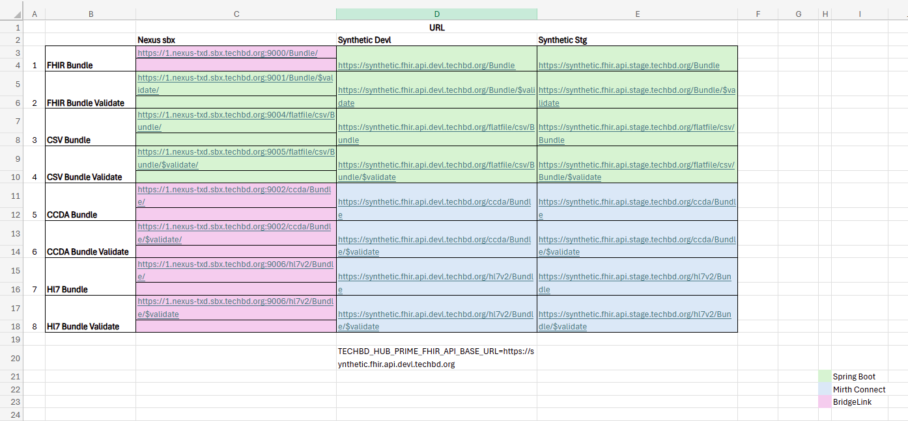
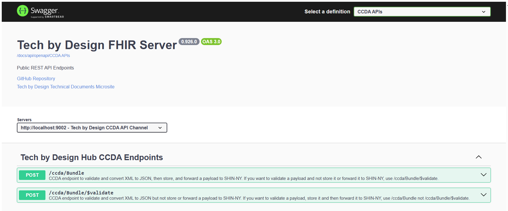
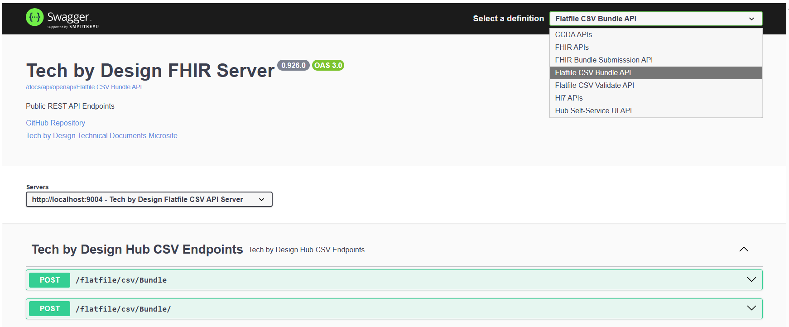

# Swagger updates — changes in `SwaggerConfig`

This file documents the runtime-visible changes made in
[hub-prime/src/main/java/org/techbd/service/http/SwaggerConfig.java](hub-prime/src/main/java/org/techbd/service/http/SwaggerConfig.java).

Summary
- Introduces environment-driven server URLs per API group (set via env vars).
- Adds FileUpload schema for multipart file endpoints and explicitly groups OpenAPI paths for FHIR, CCDA, HL7 and CSV channels.

Environment-driven server URLs
The OpenAPI groups set custom server URLs from environment variables. Set these in your `.envrc` or platform secrets to control the servers shown in Swagger UI:

- `TECHBD_HUB_PRIME_FHIR_UI_BASE_URL`
- `TECHBD_HUB_PRIME_FHIR_BUNDLE_API_BASE_URL`
- `TECHBD_HUB_PRIME_FHIR_VALIDATE_API_BASE_URL`
- `TECHBD_HUB_PRIME_CSV_BUNDLE_API_BASE_URL`
- `TECHBD_HUB_PRIME_CSV_VALIDATE_API_BASE_URL`
- `TECHBD_HUB_PRIME_CCDA_API_BASE_URL`
- `TECHBD_HUB_PRIME_Hl7_API_BASE_URL`

API groups and notable paths
- Hub Self-Service UI API: `/api/ux/**`, `/actuator/**`, `/presentation/shell/**`, `/support/interaction/**`, `/interactions/**`, `/mock/shinny-data-lake/**`
- FHIR Bundle Submission: `/Bundle` (multipart upload)
- FHIR validate / metadata: `/metadata`, `/Bundle/$validate`, `/Bundle/$status/**`, `/api/expect/fhir/**`
- CCDA: `/ccda/Bundle`, `/ccda/Bundle/$validate` (multipart upload)
- HL7: `/hl7v2/Bundle`, `/hl7v2/Bundle/$validate` (multipart upload)
- CSV flatfile: `/flatfile/csv/Bundle`, `/flatfile/csv/Bundle/$validate`

FileUpload schema
- A reusable OpenAPI `FileUpload` schema is added to components for endpoints that accept multipart form-data `file` fields. Use this when adding new file-upload endpoints so the Swagger UI shows the correct form UI.

Developer action items
- Add the relevant `TECHBD_...` env vars to your `.envrc` or CI environment to see correct server URLs in Swagger UI.
- If you implement new persistence strategies, ensure the servlet that handles interactions understands the `nature` values and emits matching response headers using `Interactions.Servlet.HeaderName.PREFIX`.
- When changing API paths, update the grouped paths in `SwaggerConfig` so Swagger UI remains consistent.

References
- Implementation: [hub-prime/src/main/java/org/techbd/service/http/SwaggerConfig.java](hub-prime/src/main/java/org/techbd/service/http/SwaggerConfig.java)

Screenshots

